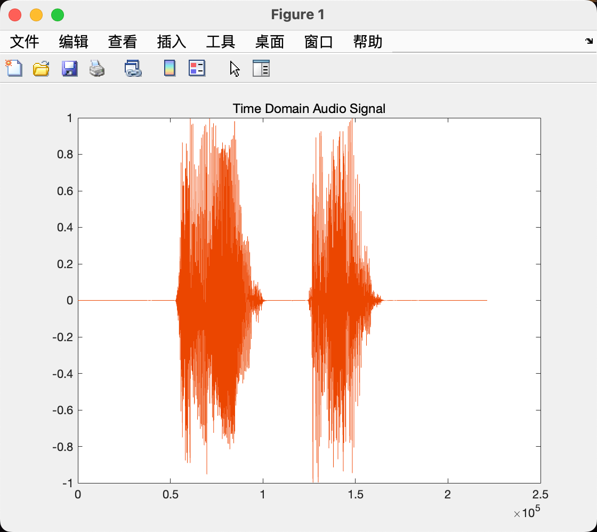
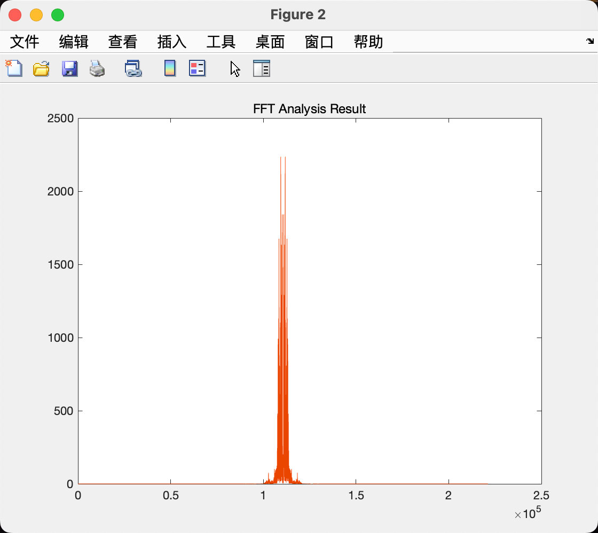
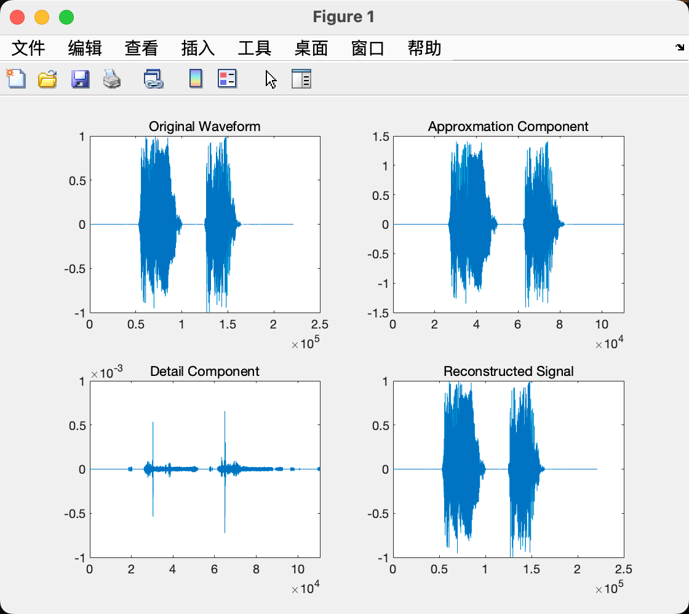
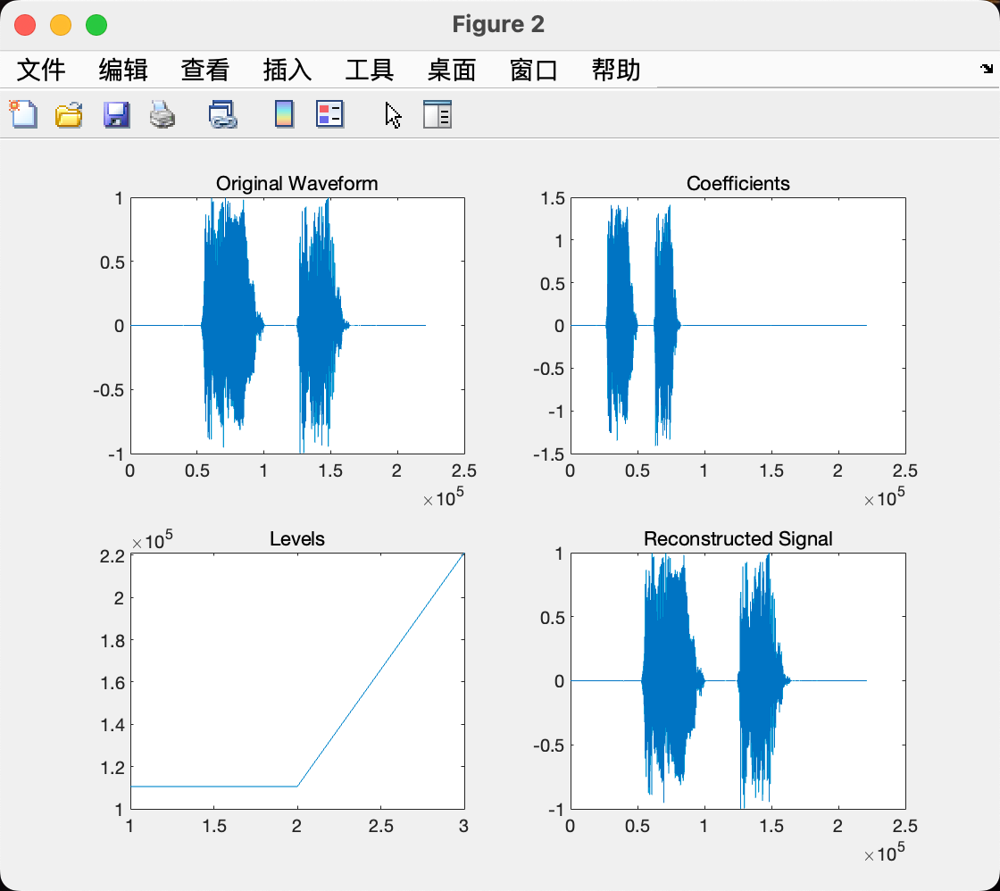
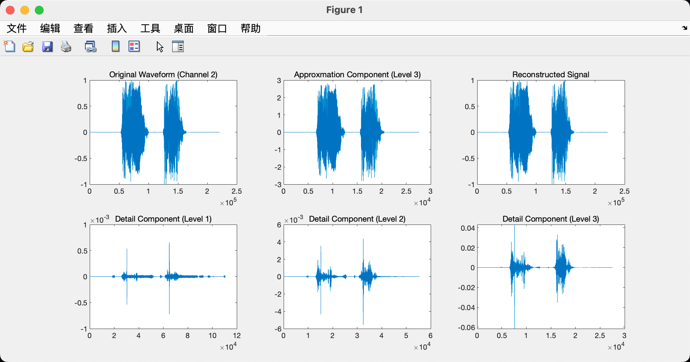
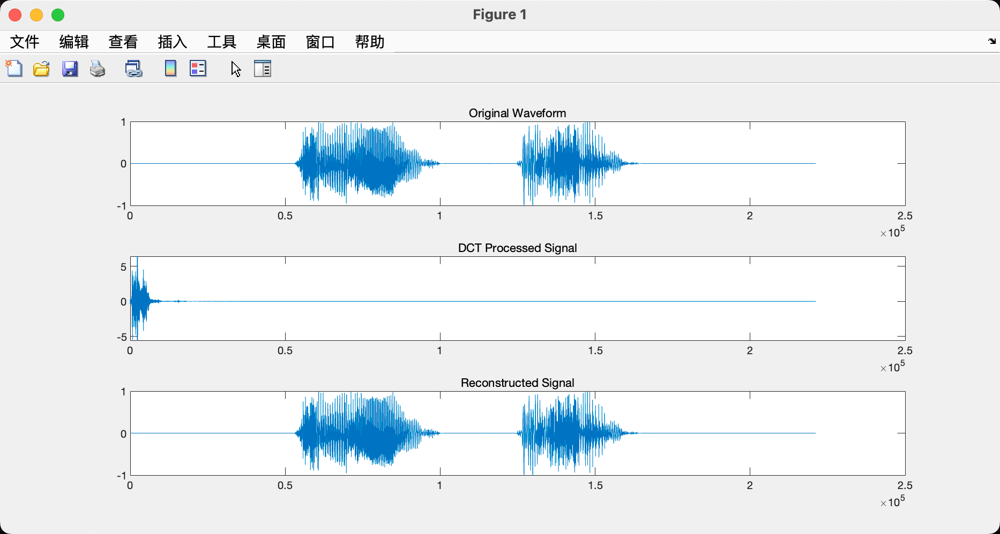
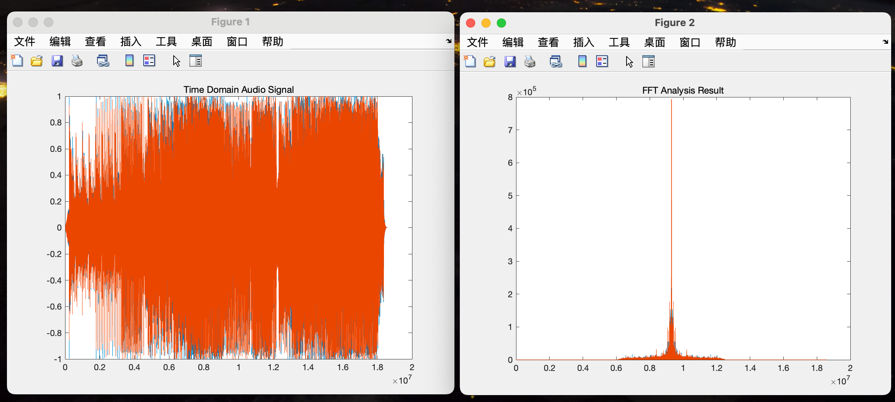
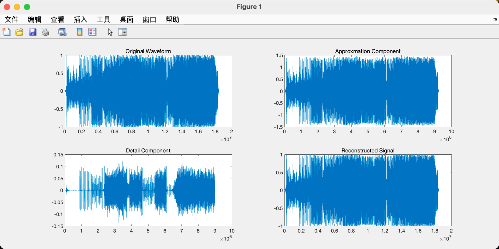
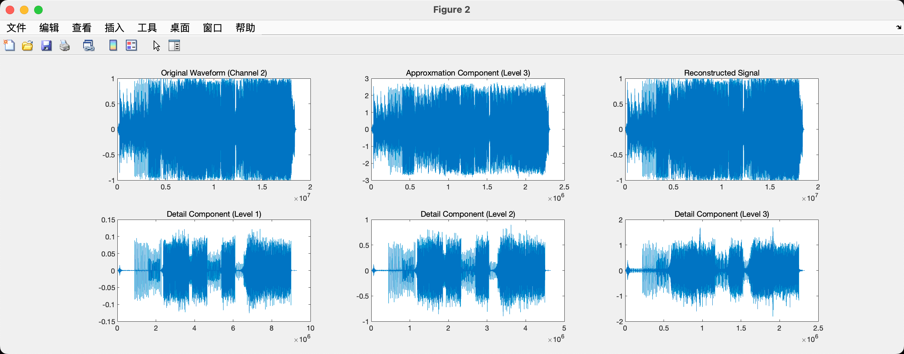
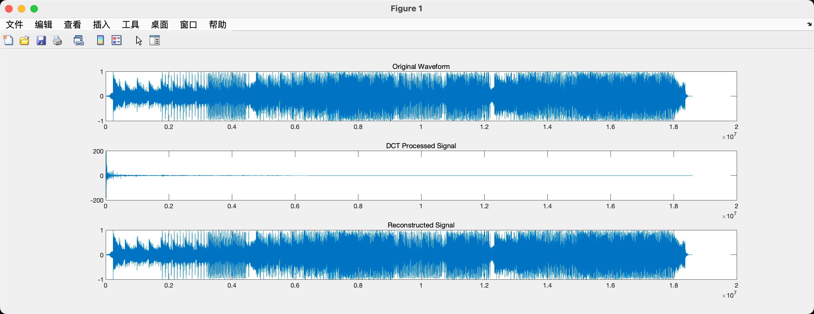

# 信息隐藏 Lab-02 语音信号处理

> 武桐西 2112515 信息安全

## 一、实验目的与实验要求

语音信号的常用处理方法上机实验，主要包括以下三种语音处理方法：

1. FFT (Fast Fourier Transform) 快速傅里叶变换
2. DWT (Discrete Wavelet Transform) 离散小波变换
3. DCT (Discrete Consine Transform) 离散余弦变换

在MatLab中调试完成课堂上的例题，练习使用常用的语音信号处理方法。

## 二、实验原理

常用的语音信号处理方法主要有**快速傅里叶变换**（FFT）、**离散小波变换**（DWT）、**离散余弦变换**（DCT）等。

### 2.1 快速傅里叶变换 FFT

快速傅里叶变换（Fast Fourier Transform，FFT）是一种高效计算傅里叶变换的算法，特别适用于数字信号处理和频谱分析。它通过将 $N$ 个信号点的离散傅里叶变换（DFT）计算复杂度从 $O(N^2)$ 降低到 $O(N \log N)$，大大提高了计算效率。

#### 傅里叶变换与快速傅里叶变换

傅里叶变换（Fourier Transform，FT）是一种将时域信号转换为频域信号的数学工具，可以将信号表示为不同频率的正弦和余弦函数的叠加。但是，对于具有 $ N $ 个数据点的信号，直接计算傅里叶变换的复杂度为 $ O(N^2) $，当 $N$ 很大时，计算量非常巨大。

FFT是一种基于**分治**思想的快速计算DFT的算法。它将 $N$ 个数据点的DFT分解为 $N$ 模为 $N/2$ 的子问题，并利用对称性质和重复计算的方式将计算复杂度降低到 $O(N \log N)$。

#### FFT算法流程

1. **将信号长度扩展为2的幂次方：** 如果信号长度不是2的幂次方，需要进行补零操作将其扩展为2的幂次方，以便进行FFT计算。
2. **蝶形运算（Butterfly Operation）：** 将信号分为偶数位和奇数位，然后对每一级进行蝶形运算，蝶形运算是FFT计算的核心步骤，通过旋转因子进行复数乘法和加法操作。
3. **迭代计算：** 不断迭代执行蝶形运算，直到计算完成整个频谱。

#### FFT的应用

FFT在信号处理和频谱分析中有广泛应用，包括但不限于：

- **信号滤波**：通过将信号转换到频域进行滤波操作，例如低通滤波、高通滤波等。
  
- **频谱分析**：分析信号的频谱特征，例如功率谱密度、频谱响应等。
  
- **图像处理**：在图像处理中，FFT可以用于图像增强、去噪、压缩等操作。
  
- **通信系统**：在调制解调、信号解析等方面有重要应用。

#### 注意事项

- **信号长度要求：** FFT要求信号长度为2的幂次方，如果信号长度不符合要求，需要进行零填充或截断处理。
  
- **频谱解释：** FFT输出的频谱是对称的，一般只需要分析频谱的一半即可，另一半是镜像对称的。

FFT作为一种高效的信号处理工具，在数字信号处理、通信系统、图像处理等领域都有广泛的应用，并且在实际工程中被广泛采用。

### 2.2 离散小波变换 DWT

离散小波变换（Discrete Wavelet Transform，DWT）是一种用于信号处理和图像处理的变换方法，它能够将信号或图像分解成不同尺度和频率的小波系数，从而更好地捕捉信号或图像的局部特征和细节信息。以下是对离散小波变换的详细介绍：

### 离散小波变换的数学原理

给定一个信号 $f(x)$，离散小波变换可以分解为两个部分：**低频**部分（**近似系数**）和**高频**部分（**细节系数**）。变换过程可以用下面的公式表示：

$$
f(x) = A_0(x) + D_0(x)
$$

其中，$A_0(x)$ 是低频部分，$D_0(x)$ 是高频部分。进一步地，$A_0(x)$ 和 $D_0(x)$ 可以继续进行分解：

$$
A_0(x) = A_1(x) + D_1(x)
$$

继续分解得到：

$$
A_1(x) = A_2(x) + D_2(x)
$$

以此类推，可以得到多层的分解结果，其中 $A_n(x)$ 表示第 $n$ 层的低频部分，$D_n(x)$ 表示第 $n$ 层的高频部分。

#### 离散小波变换的特点

- **多尺度分解**：离散小波变换能够对信号进行多尺度分解，捕捉不同频率和尺度下的特征信息。
  
- **局部特征提取**：通过分解得到的高频部分，可以提取信号或图像的局部细节特征，例如边缘、纹理等。
  
- **能量集中**：离散小波变换可以将信号或图像的能量集中在较少的小波系数上，从而实现较好的压缩效果。

#### 离散小波变换的应用

- **信号处理**：在信号处理领域，离散小波变换用于信号的分析、去噪、压缩等操作。
  
- **图像处理**：在图像处理中，离散小波变换可以用于图像的分解、增强、去噪、压缩等方面。
  
- **数据压缩**：离散小波变换在数据压缩领域有广泛应用，能够实现高效的数据压缩和传输。

#### 实现方式

离散小波变换的实现方式包括基于滤波器的方法和基于矩阵运算的方法。常用的小波函数包括Haar小波、Daubechies小波、Biorthogonal小波等，不同的小波函数适用于不同的应用场景。

通过离散小波变换，我们可以更好地理解和处理信号或图像的局部特征和细节信息，为信号处理和图像处理提供了一种有效的工具和方法。

### 2.3 离散余弦变换 DCT

离散余弦变换（Discrete Cosine Transform，DCT）是一种常用于信号处理和图像处理的变换方法，它可以将信号或图像转换到频率域，用于分析、压缩和处理信号或图像的特征。以下是对离散余弦变换的详细介绍：

#### 数学原理

给定一个长度为 $N$ 的信号 $ f(x) $，其一维离散余弦变换可以表示为：

$$
F(u) = \sum_{x=0}^{N-1} f(x) \cos \left[ \frac{(2x+1)u\pi}{2N} \right], \quad u = 0, 1, 2, \ldots, N-1
$$

其中，$F(u)$ 是变换后的频率域系数，$f(x)$ 是原始信号，$u$ 是频率域中的变量。

对于二维离散余弦变换（2D DCT），其原理类似，可以将二维信号 $f(x, y)$ 转换为频率域系数 $F(u, v)$。具体公式如下：
$$
F(u, v) = \frac{2}{\sqrt{MN}} \sum_{x=0}^{M-1} \sum_{y=0}^{N-1} f(x, y) \cos \left[ \frac{(2x+1)u\pi}{2M} \right] \cos \left[ \frac{(2y+1)v\pi}{2N} \right]
$$

#### 特点和应用

- **能量集中性**：DCT能够将信号或图像的能量集中在少数频率成分上，对高频部分进行较强的抑制，适合于信号和图像的压缩处理。
  
- **图像压缩**：DCT在图像压缩领域有广泛应用，例如JPEG图像压缩标准就采用了DCT来对图像进行频率域变换。
  
- **信号处理**：DCT在信号处理中用于谱分析、滤波、编码等操作，例如音频处理中常用的DCT变换。

- **特征提取**：通过分析DCT系数，可以提取信号或图像的特征，用于分类、识别等任务。

#### 实现方式

DCT的实现可以通过快速算法来提高计算效率，常见的有基于DCT-II算法（标准的DCT变换）和基于DCT-IV算法（用于实现快速DCT变换）等。

#### 类型

常见的DCT包括：

- **DCT-I**：一般不常用，用于实现快速算法中的一些变换步骤。

- **DCT-II**：最常见的DCT类型，用于信号和图像处理中的频率域变换。

- **DCT-III**：用于实现快速DCT变换算法。

- **DCT-IV**：用于实现快速DCT变换算法，常见于JPEG压缩等应用中。

通过离散余弦变换，我们可以将信号或图像转换到频率域，实现信号处理、图像压缩等应用，为数字信号处理和图像处理提供了一种有效的工具和方法。

## 三、实验过程

### 3.1 语音音频准备

本次实验，我录制了一段自己的音频，内容为“Hello! 你好！”，时长约为 $2s$ ，命名为 `hello.wav` ，存储在 `audio` 文件夹下。

```matlab
% Check hello.wav
clc;
clear;
close all;

% Read Audio
[audio, Fs] = audioread('audio/hello.wav');

% Play the audio
sound(audio, Fs);

figure;
plot(audio);
title('Time Domain Audio Signal');
```

运行上面的代码，可以播放这段音频，并绘制出其时域信号波形。



### 3.2 快速傅里叶变换 FFT

```matlab
% Fast Fourier Transform (FFT)
clc;
clear;
close all;

% Read Audio
[audio, Fs] = audioread('audio/hello.wav');

% Play the audio
% sound(audio, Fs);

figure;
plot(audio);
title('Time Domain Audio Signal');

audioFFT = fft(audio); % Fast Fourier Transform (FFT)
figure;
plot(abs(fftshift(audioFFT)));
title('FFT Analysis Result');
```

上述代码对音频 `hello.wax` 进行FFT分析，主要内容为：

1. **音频读取**：使用 `audioread` 函数读取音频文件。注意：`wavread` 函数在新版本的MATLAB中已经弃用，应该使用心的 `audioread` 函数。
2. **快速傅里叶变换**：使用 `fft` 函数对音频进行快速傅里叶变换FFT。
3. **音频结果显示**：绘制原始音频波形；先使用 `fftshift` 函数调整 `fft` 函数的输出顺序，将零频分量移到频谱中心，然后使用 `abs` 函数计算复数的模长，然后绘制出FFT处理后的音频波形。

运行上述代码，FFT处理结果如下：



### 3.3 离散小波变换 DWT

#### 一级小波分解（`dwt`）

```matlab
% Discrete Wavelet Transform (DWT)
clc;
clear;
close all;

% Read Audio
[audio, Fs] = audioread('audio/hello.wav');

[ca1, cd1] = dwt(audio(:,1), 'db4'); % DWT
reconstruct_audio = idwt(ca1, cd1, 'db4', length(audio(:,1))); % Inverse DWT

% Display Results
subplot(2, 2, 1); plot(audio(:,1)); title('Original Waveform');
subplot(2, 2, 2); plot(ca1); title('Approxmation Component');
subplot(2, 2, 3); plot(cd1); title('Detail Component');
subplot(2, 2, 4); plot(reconstruct_audio); title('Reconstructed Signal');
```

上述代码对原始音频进行一级小波变换处理，其主要过程如下：

1. **音频读取**：使用 `audioread` 函数读取音频；
2. **离散小波变换**：使用 `dwt` 函数对音频进行离散小波变换DWT，得到DWT处理后的音频（包括**近似分量**与**细节分量**）；采用的小波基函数是 Daubechies-4 函数。
3. **离散小波逆变换**：采用 `idwt` 函数进行离散小波变换的逆变换（Inverse DWT），对DWT得到的**近似分量**以及**细节分量**进行逆变换，重构出原始音频。
4. **结果显示**：最后，绘图展示小波分解与重构结果。

运行上述代码，结果如下：


其中，左上角是**原音频波形**，右上角是DWT处理后的**近似分量**，左下角是DWT处理后的**细节分量**，右下角是Inverse DWT得出的**重构的音频波形**。

观察结果，可以看出，DWT处理后得到的**近似分量与细节分量的长度均为原始音频长度的一半**，并且二者通过 Inverse DWT 重构出的音频与原始音频非常相似。

#### 一级小波分解（`wavedec`）

下面我们采用另一种方式进行一级小波分解：

```matlab
% Discrete Wavelet Transform (DWT)
clc;
clear;
close all;

% Read Audio
[audio, Fs] = audioread('audio/hello.wav');

[coefs, levels] = wavedec(audio(:,1), 1, 'db4'); % DWT
reconstruct_audio = waverec(coefs, levels, 'db4'); % Inverse DWT

ca1 = appcoef(coefs, levels, 'db4', 1); % 提取第1层的近似系数
cd1 = detcoef(coefs, levels, 1); % 提取第1层的细节系数

% Display Results
subplot(2, 2, 1); plot(audio(:,1)); title('Original Waveform');
subplot(2, 2, 2); plot(ca1); title('Approxmation Component');
subplot(2, 2, 3); plot(cd1); title('Detail Component');
subplot(2, 2, 4); plot(reconstruct_audio); title('Reconstructed Signal');

figure;
subplot(2, 2, 1); plot(audio(:,1)); title('Original Waveform');
subplot(2, 2, 2); plot(coefs); title('Approxmation Component');
subplot(2, 2, 3); plot(levels); title('Detail Component');
subplot(2, 2, 4); plot(reconstruct_audio); title('Reconstructed Signal');
```

上面的代码基本与之前的代码一致，只不过在这里我们使用 `wavedec` 进行小波变换，使用 `wavedec` 进行音频重构。

1. **音频读取**：使用 `audioread` 函数读取音频。
2. **离散小波变换**：使用 `wavedec` 进行离散小波变换，仍然采用 Daubechies-4 作为小波基函数；需要注意的是， `wavedec` 可以进行多级小波分解，这里传入参数 `1` 表示只需要一级小波分解。
3. **近似系数与细节系数获取**：使用 `appcoef` 提取某一层（这里是第1层）的近似系数，使用 `detcoef` 函数提取某一层（这里同样是第一层）的细节系数。
4. **音频重构**：使用 `waverec` 函数进行音频重构。
5. **结果展示**：绘图，展示结果。

运行结果如下：





可以看到 `wavedec` 与 `wavedec` 函数也能正确实现 DWT 和 Inverse DWT，二者在一级小波分解的结果是完全相同的。

> 值得注意的是，`wavedec` 函数不仅可以实现一级小波分解，而且也可以实现多级小波分解。

#### 三级小波分解

```matlab
% Discrete Wavelet Transform (DWT)
clc;
clear;
close all;

% Read Audio
[audio, Fs] = audioread('audio/hello.wav');

[coefs, levels] = wavedec(audio(:,2), 3, 'db4'); % DWT
reconstruct_audio = waverec(coefs, levels, 'db4'); % Inverse DWT

ca3 = appcoef(coefs, levels, 'db4', 3); % 提取第3层的近似系数
cd3 = detcoef(coefs, levels, 3); % 提取第3层的细节系数
cd2 = detcoef(coefs, levels, 2); % 提取第2层的细节系数
cd1 = detcoef(coefs, levels, 1); % 提取第1层的细节系数

% Display Results
subplot(2, 3, 1); plot(audio(:,2)); title('Original Waveform (Channel 2)');
subplot(2, 3, 2); plot(ca3); title('Approxmation Component (Level 3)');
subplot(2, 3, 3); plot(reconstruct_audio); title('Reconstructed Signal');
subplot(2, 3, 4); plot(cd1); title('Detail Component (Level 1)');
subplot(2, 3, 5); plot(cd2); title('Detail Component (Level 2)');
subplot(2, 3, 6); plot(cd3); title('Detail Component (Level 3)');
```

上述代码的基本思路与前面的基本一致，主要区别在于 `wavedec` 函数采用了三级小波分解，这里不在赘述。

运行结果如下：



可以看到，对于三级小波分解，每一级的细节分量和近似分量的长度均变为上一级长度的一半，即一级小波分解的分量长度是原音频长度的一半，二级小波分解的分量是一级小波分解分量长度的一半（原音频长度的 $\frac{1}{4}$ ），三级小波分解分量长度是二级小波分解分量长度的一半（原音频长度的 $\frac{1}{8}$ ）。

同时可以看到，重构后的信号与原始信号基本一致。

### 3.4 离散余弦变换 DCT

```matlab
% Discrete Consine Transform (DCT)
clc;
clear;
close all;

% Read Audio
[audio, Fs] = audioread('audio/hello.wav');

audioDCT = dct(audio(:,1)); % DCT
reconstruct_audio = idct(audioDCT); % Inverse DCT

% Display Results
subplot(3, 1, 1); plot(audio(:,1)); title('Original Waveform');
subplot(3, 1, 2); plot(audioDCT); title('DCT Processed Signal');
subplot(3, 1, 3); plot(reconstruct_audio); title('Reconstructed Signal');
```

上述代码的主要思路如下：

1. **音频读取**：使用 `audioread` 函数读取音频。
2. **离散余弦变换**：使用 `dct` 函数进行离散余弦变换DCT，对音频信号进行处理。
3. **离散余弦逆变换**：使用 `idct` 函数进行离散余弦变换的逆变换 Inverse DCT，对音频信号进行重构。

运行结果如下：



可以看到，DCT能够极大的压缩音频长度；同时能够保持较好的重构行。

### 3.5 其他音频的尝试

由于我所选取的音频时长较短，只有 $2s$ 左右，因此为了观察以上语音信号处理方法对长音频的处理效果，我又选取了一首歌曲时长 $3min$ 的歌曲。

以下是实验结果：

- FFT

  

- DWT

  

  

- DCT

  

从实验结果中可以看到与前面相同的结论，这里不在赘述。

## 四、总结与感悟

- 通过本次实验，我熟悉了快速傅里叶变换FFT、离散小波变换DWT、离散余弦变换DCT等常用的语音信号的处理方法的基本原理和使用方法，并亲自动手实践，探究其处理特点以及各自的优缺点和适用场景。
- 探究了不同的语音信号处理方法对长音频与短音频的处理效果，并比较了二者的异同点。
- 了解了常见的语音处理算法后，我认识到：
  - 可以通过这些方法将信号从时域信号转变到变换域（如频域、时—频域、小波域等）；
  - 由于处理后能力集中，因此可以用来压缩编码；
  - 从处理结果分析，可以辅助决定信息隐藏的位置。

- 相信这次实验可以为后续的信息隐藏能力的提升打下坚实的基础，希望以后在信息隐藏这条道路上继续探索、不断进步。
