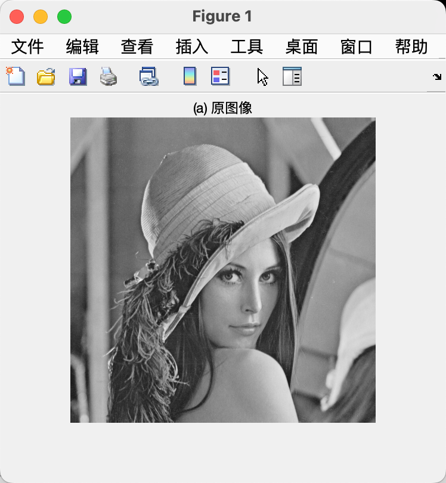
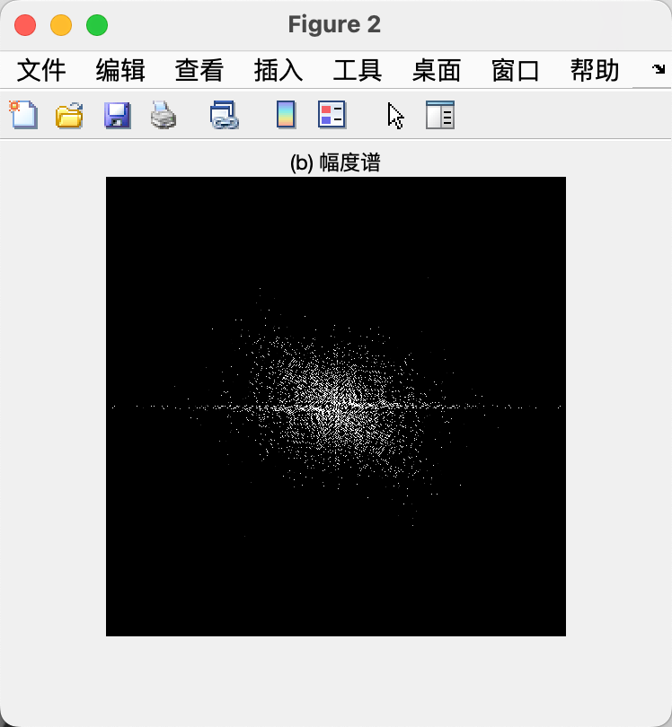
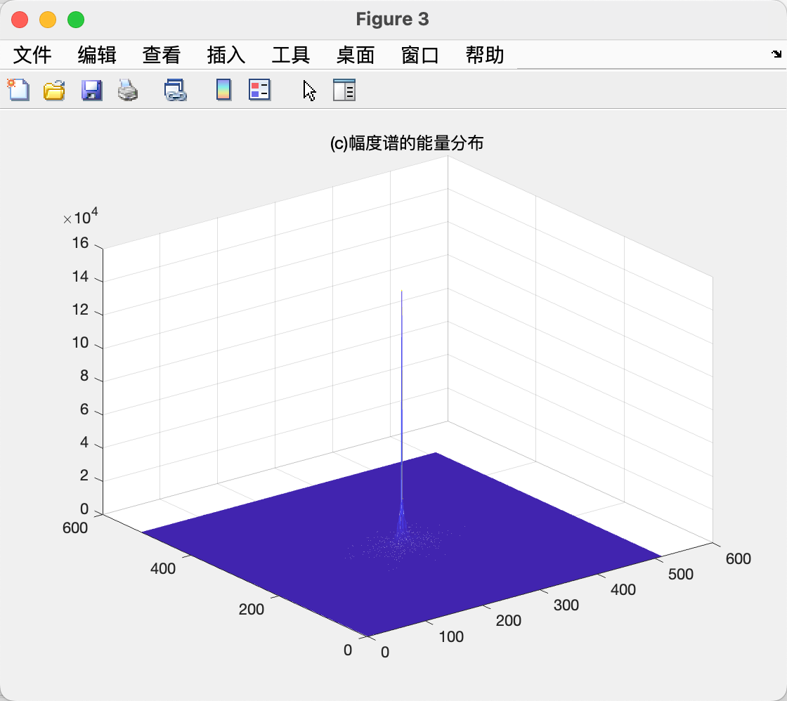
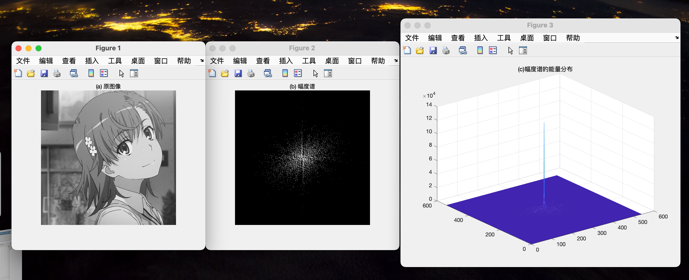
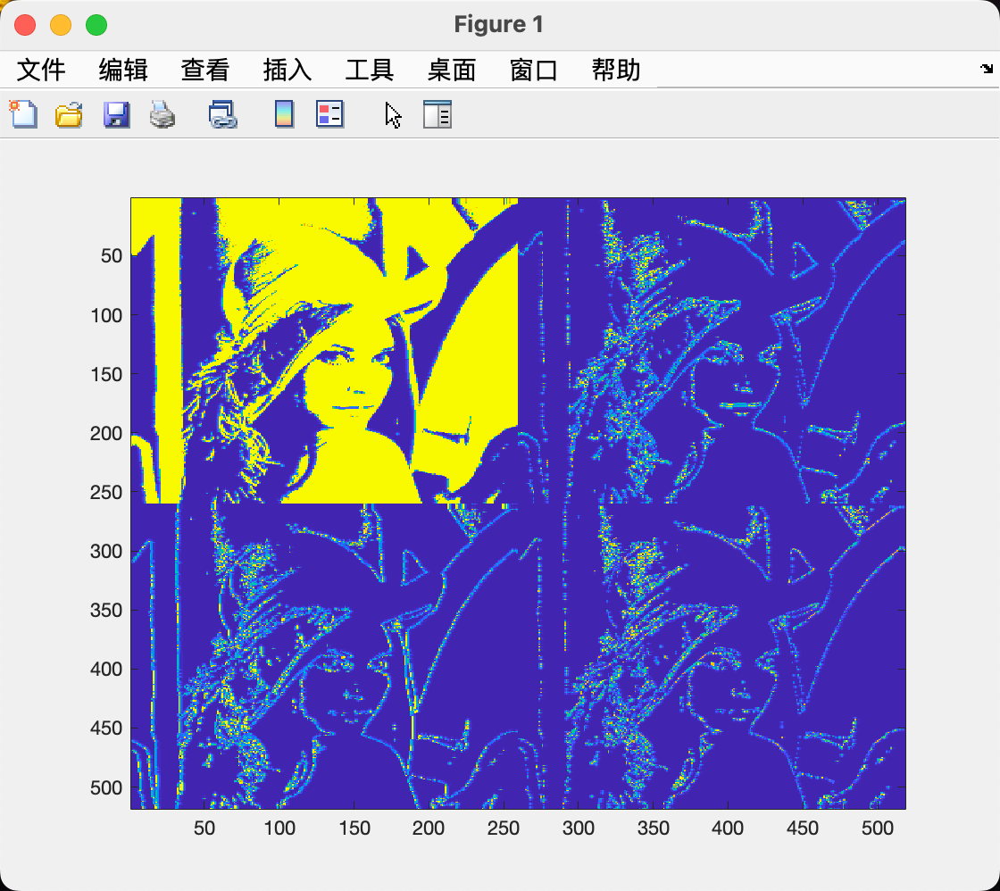
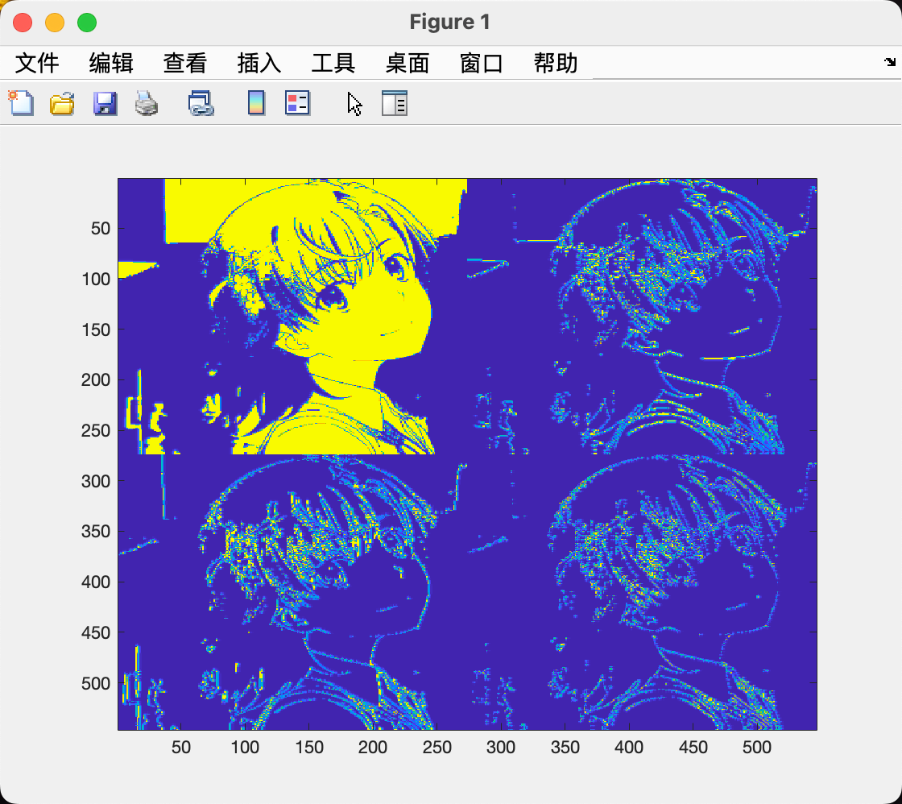
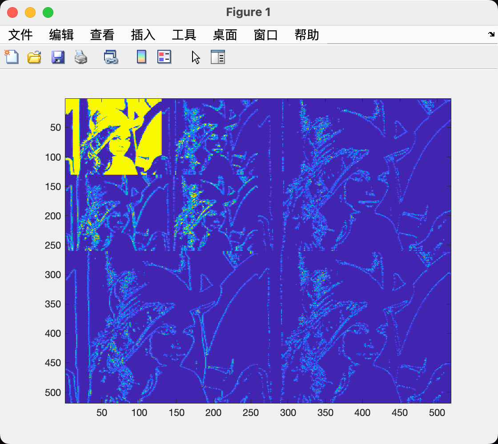
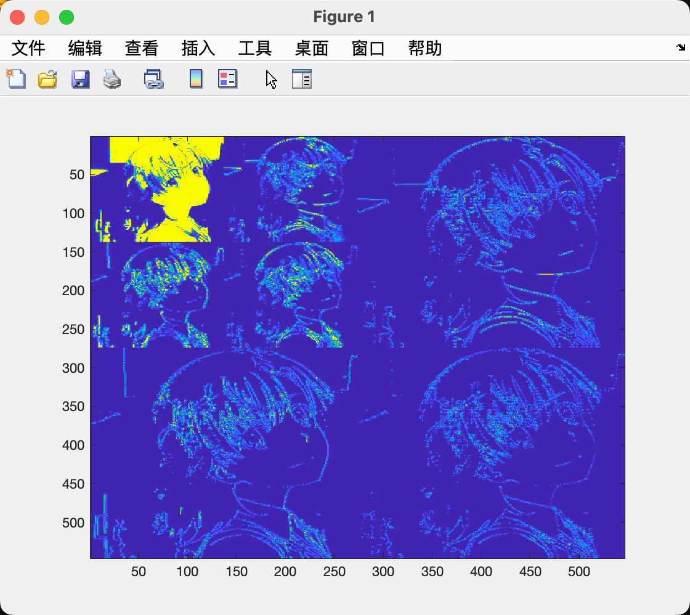
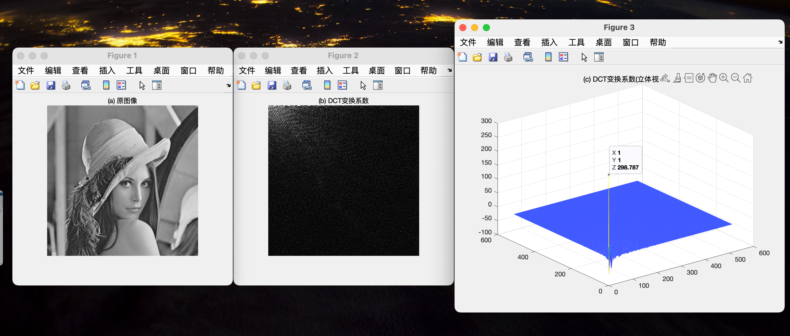
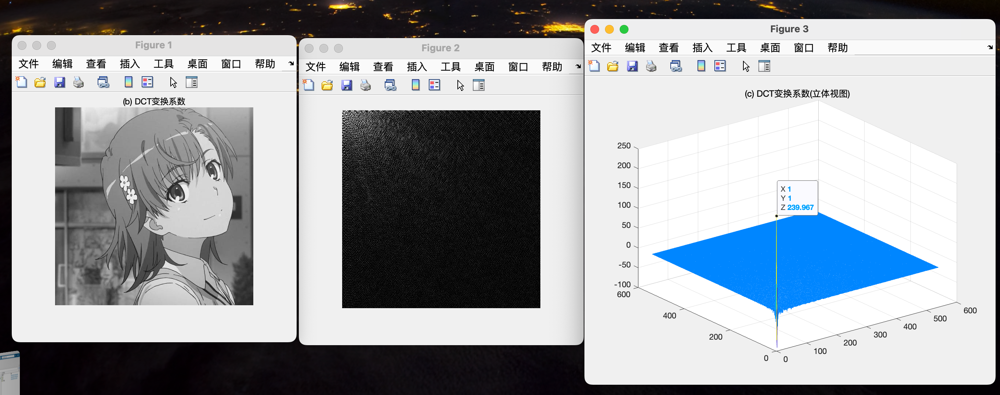

# 信息隐藏 Lab-03 图像信号处理

> 武桐西 2112515 信息安全

## 一、实验目的与实验要求

图像信号的常用处理方法上机实验，主要围绕一下三种处理技术：

1. DFT (Discrete Fourier Transform) 离散傅里叶变换
2. DWT (Discrete Wavelet Transform) 离散小波变换
3. DCT (Discrete Consine Transform) 离散余弦变换

在MatLab中调试完成课堂上的例题，练习使用常用的图像信号处理方法。

## 二、实验原理

常用的图像处理方法主要包括：**二维离散傅里叶变换**（DFT）、**二维离散小波变换**（DWT）、**二维离散余弦变换**（DCT）等。

### 2.1 二维离散傅里叶变换（DFT）

二维离散傅里叶变换（2D Discrete Fourier Transform，DFT）是图像处理中常用的技术之一，它将图像从空间域转换到频率域，使得我们可以更好地理解图像的频率特性和进行相应的处理。

#### 正变换（Forward Transform）

给定一个二维的离散信号 $f(x, y)$ ，其二维离散傅里叶变换为：

$$
F(u, v) = \frac{1}{MN} \sum_{x=0}^{M-1} \sum_{y=0}^{N-1} f(x, y) e^{-j2\pi(\frac{ux}{M} + \frac{vy}{N})}
$$
其中， $M$ 和 $N$ 分别表示图像的宽度和高度，$u$ 和 $v$ 是频率域中的变量，$e$ 是自然对数的底，$j$ 是虚数单位。

正变换将图像从空间域转换到频率域，可以用于频域分析和滤波等操作。正变换公式为上述的傅里叶变换公式。

#### 反变换（Inverse Transform）

反变换将频率域的图像重新转换回空间域，公式为：

$$
f(x, y) = \sum_{u=0}^{M-1} \sum_{v=0}^{N-1} F(u, v) e^{j2\pi(\frac{ux}{M} + \frac{vy}{N})}
$$

#### 特性

- **线性性质**：二维离散傅里叶变换具有线性性质，即对图像的线性组合进行变换等于各个图像分别进行变换后再线性组合。

- **频率信息**：频率域中的低频部分对应图像中的平滑区域，高频部分对应图像中的细节和边缘。

- **能量保持**：傅里叶变换和逆变换之间能量保持不变，即变换后的频谱能量等于原始图像的能量。

- **卷积性质**：在频率域中，图像的卷积等于对应频谱的乘积，这种性质在滤波和图像增强中非常有用。

二维离散傅里叶变换在图像处理中被广泛应用，例如用于图像压缩、滤波、频域分析、特征提取等方面。通过理解其原理和特性，可以更加有效地利用该技术进行图像处理和分析。

### 2.2 二维离散小波变换（DWT）

二维离散小波变换（2D Discrete Wavelet Transform，DWT）是一种用于图像处理的技术，它能够将图像分解成不同尺度和方向的小波系数，从而更好地捕捉图像的局部特征和细节信息。

二维离散小波变换通常包括两个步骤：**分解**（Decomposition）和**重构**（Reconstruction）。设 $f(x, y)$ 是一个二维信号（即图像），其小波变换可以表示为：

1. **分解（Decomposition）**：
$$
   W_{\psi}(a, b) = \sum_{m} \sum_{n} f(m, n) \psi_{a,b}(m, n)
   $$
   其中，$W_{\psi}(a, b)$ 是小波系数，$\psi_{a,b}(m, n)$ 是小波函数在尺度 $a$ 和平移 $b$ 下的变换结果。

2. **重构（Reconstruction）**：
   $$
   f(m, n) = \sum_{a} \sum_{b} W_{\psi}(a, b) \phi_{a,b}(m, n)
   $$
   其中，$\phi_{a,b}(m, n)$ 是重构小波函数。

#### 主要小波函数

常用的二维小波函数包括：

- **Haar小波**：是一种简单且有效的小波函数，适用于处理图像中的边缘信息。
  
- **Daubechies小波**：是一类具有紧支撑、正交性和多尺度性质的小波函数，常用于图像压缩和去噪。

- **Biorthogonal小波**：具有对称性和正交性，适用于一些特定的图像处理任务。

#### 图像处理应用

二维小波变换在图像处理中有许多应用，包括但不限于：

- **图像压缩**：小波变换能够提取图像的重要信息，并利用稀疏性进行压缩。
  
- **图像去噪**：小波变换可以将图像分解成不同频率的小波系数，利用稳定性较好的小波系数来去除图像中的噪声。
  
- **图像增强**：通过分析不同尺度和方向的小波系数，可以增强图像的细节和特征，使图像更清晰。

- **边缘检测**：Haar小波等小波函数在边缘检测方面具有良好的性能，可以有效地提取图像中的边缘信息。

- **特征提取**：利用小波变换的多尺度特性，可以提取图像中的局部特征，用于图像识别和分类。

通过二维离散小波变换，我们可以更好地理解和处理图像中的局部特征和细节信息，从而实现各种图像处理任务。

### 2.3 二维离散余弦变换（DCT）

二维离散余弦变换（2D Discrete Cosine Transform，DCT）是一种常用于图像处理和压缩的技术，它能够将图像从空间域转换到频率域，使得图像的能量更集中在少数频率上，从而实现图像的压缩和编码。

给定一个二维的离散信号 $f(x, y)$，其二维离散余弦变换可以表示为：
$$
F(u, v) = \frac{2}{\sqrt{MN}} \sum_{x=0}^{M-1} \sum_{y=0}^{N-1} f(x, y) \cos \left[ \frac{(2x+1)u\pi}{2M} \right] \cos \left[ \frac{(2y+1)v\pi}{2N} \right]
$$

其中，$M$ 和 $N$ 分别表示图像的宽度和高度，$u$ 和 $v$ 是频率域中的变量，$F(u, v)$ 是变换后的频域系数。

其逆变换如下：
$$
f(x, y) = \frac{2}{\sqrt{MN}} \sum_{u=0}^{M-1} \sum_{v=0}^{N-1} F(u, v) \cos \left[ \frac{(2x+1)u\pi}{2M} \right] \cos \left[ \frac{(2y+1)v\pi}{2N} \right]
$$

#### 图像处理应用

二维离散余弦变换在图像处理中有多种应用，包括但不限于：

- **图像压缩**：DCT 被广泛用于图像压缩算法，例如JPEG压缩中就采用了DCT来对图像进行频率域变换。

- **图像编码**：DCT 能够将图像转换为频率域表示，从而可以对图像进行更高效的编码和传输。

- **图像增强**：DCT 可以用于图像的频域分析，从而可以对图像进行增强和处理，例如去除高频噪声等。

- **图像特征提取**：DCT 可以提取图像的频域特征，用于图像识别和分类任务中。

#### 特性

- **能量集中性**：DCT 能够将图像的能量集中在少数频率上，对图像的高频部分进行较强的抑制，从而实现较好的压缩效果。
- **局部相关性**：DCT 在图像中存在局部相关性的情况下表现较好，可以更有效地捕捉图像的特征。

通过二维离散余弦变换，我们可以将图像从空间域转换到频率域，实现图像的压缩、编码和特征提取等应用，为图像处理提供了有效的工具和方法。

## 三、实验过程

本次试验中，采用的原图像为如下两个图像：

- 图像处理领域经典Lena图像：

  

- 网络上下载的图像：

  

### 离散傅里叶变换 DFT

参照课堂中给出的代码，并进行一些修改，编写 DFT 图像处理的 MATLAB 代码如下：

```matlab
% Discrete Fourier Transform (DFT)
clear;
clc;

% Read Image
img = imread('images/LenaRGB.bmp');
% imshow(img);

% Convert RGB to Gray
figure(1);
img = rgb2gray(img);
imshow(img);
title('(a) 原图像');

figure(2);
img = imbinarize(img); % Binarize
fa = fft2(img); % FFT
ffa = fftshift(fa); % fftshift函数调整fft函数的输出顺序，将零频位置移到频谱的中心
imshow(ffa, [200,225]); % 显示灰度在200−225之间的像
title('(b) 幅度谱');

figure(3);
l = mesh(abs(ffa)); % 画网格曲面图
title("(c) 幅度谱的能量分布");
```

上述代码与课堂中给出代码的不同之处主要在于将 `im2bw` 函数替换为 `imbinarize` 来进行RGB图像的二值化，这是因为 `im2bw` 在新版本的 MATLAB 中已经不再支持。

上述代码的主要功能如下：

1. **图像读取与预处理**：读取原始RGB图像，将RGB图像灰度化，进而二值化。
2. **离散傅里叶变换**：使用 `fft2` 函数对二值化后的图像进行快速傅里叶变换。
3. **频谱显示**：使用 `fftshift` 函数调整fft函数的输出顺序，将零频位置移到频谱的中心，显示灰度在200-225之间的像素的图像。
4. **能量分布显示**：绘制频谱的网格曲面图，并显示幅度谱的能量分布。

运行上述代码，得到如下结果：

- Lena图像：







- 网络图像：



根据实验结果，我们可以发现：

1. 灰度变化缓慢的区域与低频信号近似，灰度变化大的边缘区域与高频信号近似。
2. 能量主要集中在灰度变化缓慢的低频部分，小部分能量集中在中心。

### 离散小波变换 DWT

#### 一级小波分解

```matlab
% Discrete Wavelet Transform (DWT)
clear;
clc;

% Read Image
img = imread('images/LenaRGB.bmp');
% Convert RGB to Gray
img = rgb2gray(img);
% Binarize
a = imbinarize(img);

nbcol = size(a, 1);
[ca1, ch1, cv1, cd1] = dwt2(a, 'db4'); % 采用 Daubechies-4 小波

cod_ca1 = wcodemat(ca1, nbcol);
cod_ch1 = wcodemat(ch1, nbcol);
cod_cv1 = wcodemat(cv1, nbcol);
cod_cd1 = wcodemat(cd1, nbcol);

image([cod_ca1, cod_ch1; cod_cv1, cod_cd1]);
```

代码的思路如下：

1. **图像读取与预处理**：读取图像，并进行灰度化、二值化。
2. **二维离散小波变换**：使用 `dwt2` 函数进行二维离散小波变换，小波基函数为 `db4` 。
3. **可视化处理**：使用 `wcodemat` 函数对小波系数进行可视化处理。
4. **图像显示**：使用 `image` 函数将小波系数拼接起来作为一个完整图像并显示图像。

运行上述代码，结果如下所示：





可以看到，图像的左上角为小波变换分解得到的近似分量，右上角为水平方向细节部分，左下角为垂直方向细节部分，右下角为对角线方向细节部分。

#### 二级小波分解

```matlab
% Discrete Wavelet Transform (DWT)
clear;
clc;

% Read Image
img = imread('images/LenaRGB.bmp');
% Convert RGB to Gray
img = rgb2gray(img);
% Binarize
a = imbinarize(img);

nbc = size(a, 1);
nbcol = nbc / 2;

[ca1, ch1, cv1, cd1] = dwt2(a, 'db4'); % 采用 Daubechies-4 小波
[ca2, ch2, cv2, cd2] = dwt2(ca1, 'db4'); % 二级小波分解

cod_ca1 = wcodemat(ca1, nbcol);
cod_ch1 = wcodemat(ch1, nbcol);
cod_cv1 = wcodemat(cv1, nbcol);
cod_cd1 = wcodemat(cd1, nbcol);

cod_ca2 = wcodemat(ca2, nbc);
cod_ch2 = wcodemat(ch2, nbc);
cod_cv2 = wcodemat(cv2, nbc);
cod_cd2 = wcodemat(cd2, nbc);

% 一级小波分解
% image([cod_ca1, cod_ch1; cod_cv1, cod_cd1]);

% 二级小波分解
tt = [cod_ca2, cod_ch2; cod_cv2, cod_cd2];
tt=imresize(tt, size(ca1)); % 调整图片大小
image([tt, cod_ch1; cod_cv1, cod_cd1]);
```

二级小波分解的基本操作与一级小波分解基本一致，其思路是将一级小波分解的近似分量再进行一次小波分解，即可得到二级小波分解的结果。

需要注意的是，最后需要用到 `imresize` 函数调整图像的大小，以便后续的 `image` 函数的拼接操作能正常进行。

运行上述代码，结果如下：





实际上，二级小波分解就是对一级小波分解（的近似部分）再做一次一级小波分解。

### 离散余弦变换 DCT

```matlab
% Discrete Consine Transform (DCT)
clear;
clc;

% Read Image
img = imread('images/LenaRGB.bmp');
% Convert RGB to Gray
img = rgb2gray(img);
% Binarize
I = imbinarize(img);

figure(1);
imshow(img);
title('(a) 原图像');

c = dct2(I); % Discrete Consine Transform (DCT)

figure(2);
imshow(c);
title('(b) DCT变换系数');

figure(3);
mesh(c);
title('(c) DCT变换系数(立体视图)');
```

代码的主要思路如下：

1. **图像读取与预处理**：读取图像，并进行灰度化、二值化。
2. **二维离散余弦变换**：使用 `dct2` 函数对二值图像进行二维离散余弦变换。
3. **图像显示**：使用 `imshow` 显示DCT变换系数的图像，并且使用 `mesh` 来显示DCT变换系数的立体视图。

运行上述代码，结果如下：





分析实验结果，可以看到DCT的系数主要集中在左上角，代表直流、低频系数，其余系数接近于零，因此，DCT可以广泛应用于图像压缩算法中。

## 四、总结与思考

- 经过本次实验，我进一步加深了对课堂中讲授的 DFT、DWT、DCT 等图像处理方法的原理和特点的认识和理解。
- 进一步了解了上述图像处理方法的特点及其应用，例如图像压缩、图像去噪、图像增强等。
- 在经典图像处理图片Lena的基础之上，我也尝试了其他一些图像，并比较不同的图像信号处理方法对不同的图片的处理效果的异同。
- 图像信号处理是图像信息隐藏的基础知识和基本技术手段，相信通过这次实验的学习和实践，一定会对我未来信息隐藏技术的学习打下坚实的基础，希望以后在信息隐藏这条道路上继续探索、不断进步。
