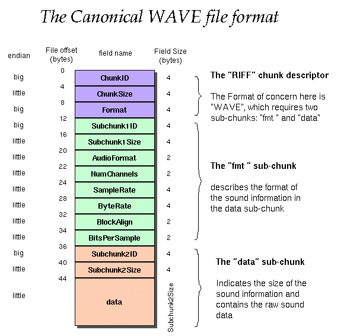
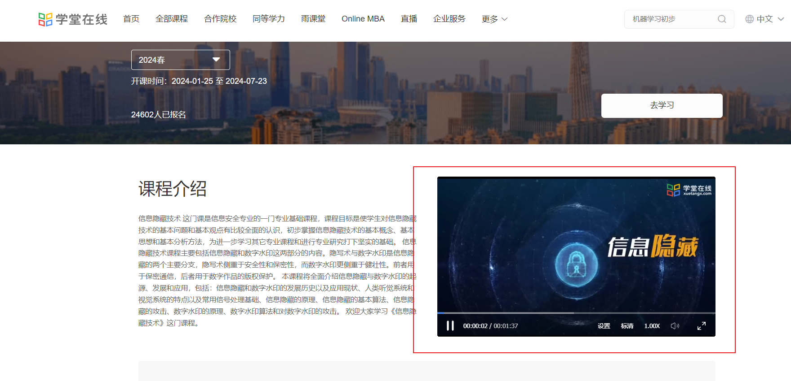
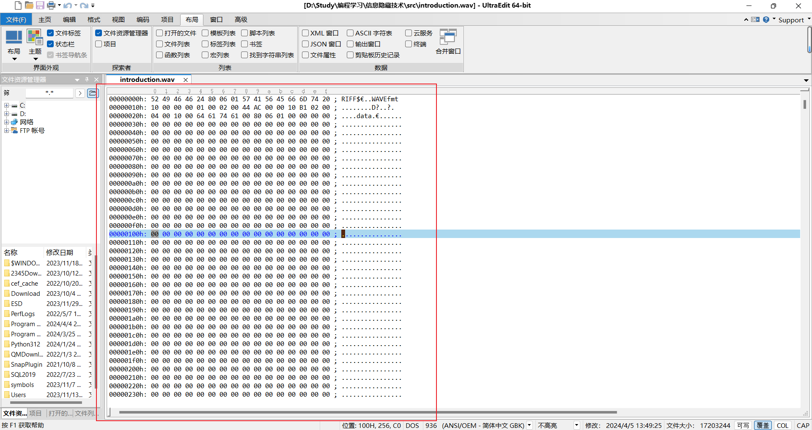
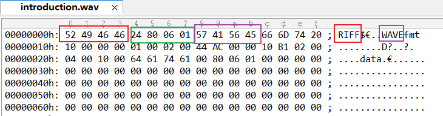
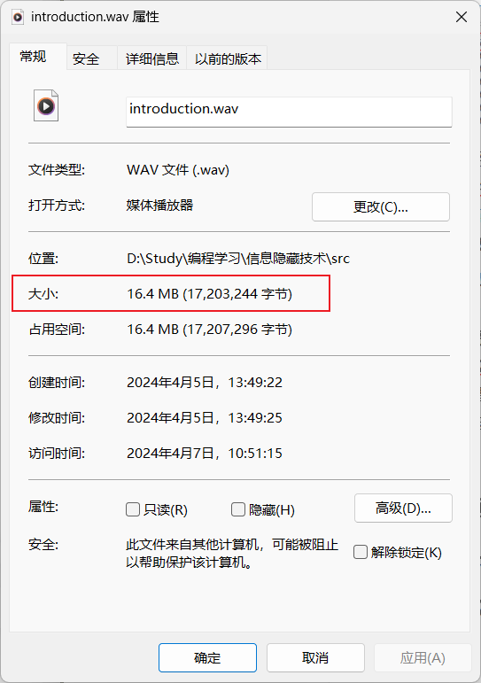
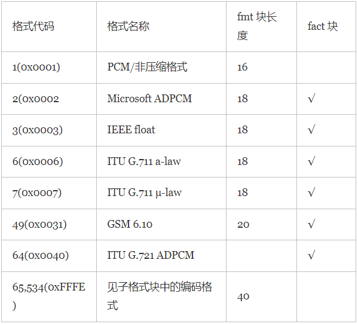
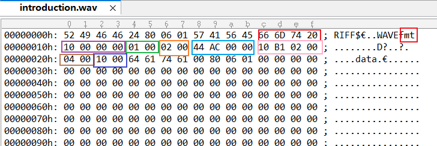
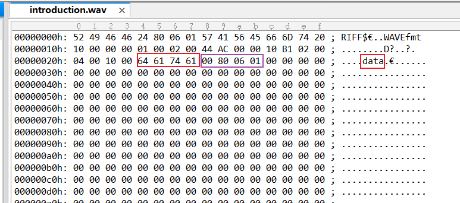
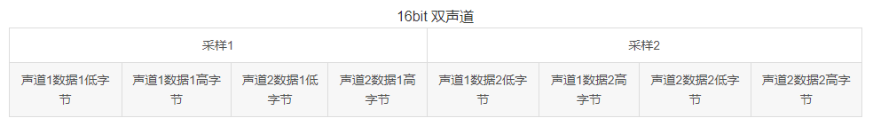
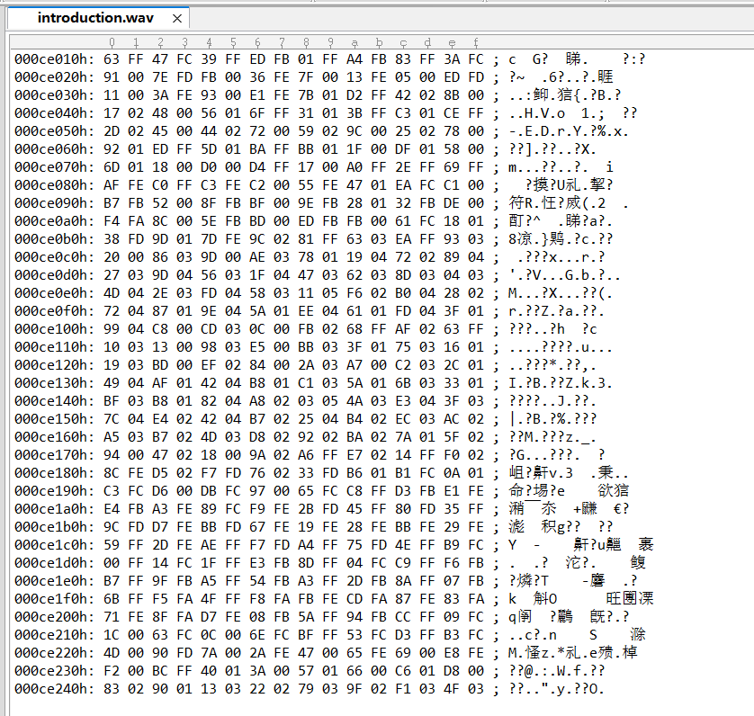

# <center>**信息隐藏技术实验报告**</center>

 <center>Lab4 媒体文件格式剖析</center>

 <center> 网络空间安全学院 信息安全专业</center>

| 2112492 | 2112515 | 2113997 | 2111408 | 2111698 |
| :-----: | :-----: | :-----: | :-----: | :-----: |
| 刘修铭  | 武桐西  | 齐明杰  | 周钰宸  | 于泽林  |

## 题目

1. 任选一种媒体文件，进行格式剖析（建议用 UltraEdit）；
2. 针对该类型的文件，讨论可能的隐藏位置和隐藏方法；
3. 实现秘密信息的隐藏和提取（选做）。

## 实验要求

1. 写出实验报告（word 或 pdf）；
2. 制作 PPT，课堂展示。

## 实验原理

### 音频隐藏的基本原理

在各种载体中有很多方法可以用于隐藏信息，其中最直观的一种是替换技术。任何数字多媒体信息，在扫描和采样时，都会产生物理随机噪声，而人的感观系统对这些随机噪声是不敏感的。替换技术就是利用这个原理，试图用秘密信息比特替换掉随机噪声，以达到隐藏秘密信息的目的。

音频信号的特点：一维信号，人耳听觉系统（HAS）比人眼视觉系统（HVS）灵敏得多。

对音频信息隐藏技术的要求：

* 透明性
* 鲁棒性（强鲁棒，抗模数转换）
* 同步
* 盲检测

数字化音频中，低有效比特对音质贡献弱，改变低有效比特不会显著影响音质。

### LSB 音频隐藏算法

符号规定：

* $c_i$：载体对象的取样值
* $s_i$：伪装对象的取样值
* $L(c)$：载体的长度
* $k$：伪装密钥

* $L(m)$：秘密信息的长度

流载体的 LSB 方法：

* 嵌入：选择一个载体元素的子集 $\{j_1,j_2,...,j_{L(m)}\}$ ，其中共有 $L(m)$ 个元素，用以隐藏秘密信息的  $L(m)$ 个比特。然后在这个子集上执行替换操作，把 $c_{j_i}$ 的最低比特用 $m_i$ 来替换。
* 提取：找到嵌入信息的伪装元素的子集 $\{j_1,j_2,...,j_{L(m)}\}$，从这些伪装对象 $S_{j_i}$ 中抽出它们的最低比特位，排列之后组成秘密信息 $m$。

如何选择隐藏位置子集？

* 顺序选取：发送者从载体的第一个元素开始，顺序选取 $L(m)$ 个元素作为隐藏的子集
  * 缺点：已经嵌入部分和未嵌入部分数据特征不同
* 随机间隔：用伪装密钥 $k$ 作为 伪随机数发生器的种子，生成一个伪随机序列 $k_1,k_2,...,k_{L(m)}$，则嵌入位置为 $j_1=k_1,k_i=j_{i-1}+k_i(i\ge2)$

LSB 算法：

* 算法实现
  * 嵌入：水印替换最低（或次低）比特
  * 提取：提取最低（或次低）比特组合为水印
* 算法设计
  * 选择样点：样点幅值大小与其掩蔽能力有关，静音段（幅值较小）的样点不宜用于隐藏
  * 选择比特位：低比特位对音质影响小，但容易受到干扰
* 算法性能
  * 透明度高
  * 容量大
  * 鲁棒性差

### WAV文件格式



## 实验过程（含主要源代码）

### WAV媒体文件准备

本次实验我们计划制作一个有创意的作品~~（整一个活）~~：**在李朝辉老师的信息隐藏技术的学堂在线课的课程介绍里面，隐藏一段著名的恶作剧视频《Never gonna give you up》，或者只是恶作剧的简单图片。**

1. 我们首先计划获取所需的WAV媒体文件，第一步我们通过**夸克浏览器下载了学堂在线的课程介绍视频文件（mp4文件）**：



2. 第二步我们通过网易云音乐下载获取了**《Never gonna give you up》的音频文件（mp3文件）。**

3. 为了能够转换为wav文件正常处理，这里首先通过`Python`代码进行**格式转换**：

   * **MP4转WAV：**

     ```python
     from pydub import AudioSegment
     
     # 加载 MP4 文件
     audio_from_mp4 = AudioSegment.from_file("Introduction.mp4")
     
     # 将音频转换为 WAV 格式并保存
     audio_from_mp4.export("Introduction.wav", format="wav")
     
     ```

   * **MP3转WAV：**

     ```python
     from pydub import AudioSegment
     
     # 加载 MP3 文件
     audio_from_mp3 = AudioSegment.from_file("Never gonna give you up.mp3")
     
     # 将音频转换为 WAV 格式并保存
     audio_from_mp3.export("Never gonna give you up.wav", format="wav")
     
     ```

4. 为了防止音频信息难以隐藏，我们还准备了一个图片文件：**NeverGonnaGiveYouUp.jpg**

   

### WAV 媒体文件格式剖析

这里根据上面的分析，首先开始使用**UltraEdit**工具对获取到的**Introduction.wav**进行WAV格式刨析。

使用工具打开后能看到具体的16进制和右边的ASCII码显示：



#### WAV文件首部

根据WAV文件首部的固有格式，需要特别注意的是：由于WAV遵循RIFF规则，并且都是由RIFF数据块组成。

尽管RIFF文件是按照小端 `little-endian`字节顺序写入的，但是**其各个部分的端序解读方法却并不统一。**对于`Size`字段就需要额外注意。

| 名称 | 偏移地址 | 字节数 | 端序     | 内容                                                         |
| ---- | -------- | ------ | -------- | ------------------------------------------------------------ |
| ID   | 0x00     | 4Byte  | 大端     | 每一个RIFF文件首先存放的必须是一个RIFF chunk，并且只能有这一个标志为RIFF的chunk。因此对于WAV文件，应为`RIFF` (0x52494646) |
| Size | 0x04     | 4Byte  | **小端** | 其data字段（WAV除去ID和Size）中数据的大小，字节数为单位。该字段的数值加 8 为当前文件的实际长度。 |
| Type | 0x08     | 4Byte  | 大端     | FourCC全称为Four-Character Codes，是一个4字节32位的标识符，通常用来标识文件的数据格式。对于WAV文件，应该为`WAVE`(0x57415645) |

从UltraEdit中，我们可以看到以下的试图，呈现的就是WAV的文件首部：



1. **ID:** 可以看到ID部分，根据大端序读出的16进制表示为0x52494646，对应的ASCII码为`RIFF`，这一点直接从右侧的ASCII码视图框也可以看到。**证明我们的WAV文件确实是RIFF文件格式。**

2. **Size：**可以看到Size部分，我们看到十六进制显示的值为24 80 06 01。**但是由于其按照小端序排序，并且地址显示是由低到高的，因此实际上此处的十六进制值应为0x01068024，对应的十进制为17203236B。**不过由于其显示的仅是data字段，因此还需要加上ID和Size字段的8B，因此总大小应为**17203244B**。

   

   通过打开文件属性，我们发现**Introduction.wav文件确实大小为16.4 MB (17,203,244 字节)，验证了我们的分析。**

3. **Type：**可以看到ID部分，根据大端序读出的16进制表示为0x57415645，对应的ASCII码为`WAVE`，这一点直接从右侧的ASCII码视图框也可以看到。**证明我们的文件确实是WAV文件格式。**

#### Format数据块

| 名称          | 偏移地址 | 字节数 | 端序 | 内容                                                         |
| ------------- | -------- | ------ | ---- | ------------------------------------------------------------ |
| ID            | 0x00     | 4Byte  | 大端 | `fmt`(0x666D7420)                                            |
| Size          | 0x04     | 4Byte  | 小端 | 格式块长度。其数值不确定,取决于编码格式。可以是16、 18 、20、40 等。 |
| AudioFormat   | 0x08     | 2Byte  | 小端 | **音频格式**。常见的 WAV 文件使用 PCM 脉冲编码调制格式,该数值通常为 1。其它音频格式如后面所示。 |
| NumChannels   | 0x0A     | 2Byte  | 小端 | **声道数**。单声道为 1,立体声或双声道为2。                   |
| SampleRate    | 0x0C     | 4Byte  | 小端 | **采样率**。每个声道单位时间采样次数。常用的采样频率有 11025, 22050 和 44100 kHz。 |
| ByteRate      | 0x10     | 4Byte  | 小端 | **每秒数据字节数（数据传输速率）**。该数值为：声道数×采样频率×每样本的数据位数/8（SampleRate * NumChannels * BitsPerSample / 8）。播放软件利用此值可以估计缓冲区的大小。 |
| BlockAlign    | 0x14     | 2Byte  | 小端 | **数据块对齐，采样帧大小**。该数值为：声道数×位数/8（NumChannels * BitsPerSample / 8）。播放软件需要一次处理多个该值大小的字节数据,用该数值调整缓冲区。 |
| BitsPerSample | 0x16     | 2Byte  | 小端 | **采样位数。**存储每个采样值所用的二进制数位数。常见的位数有 4、8、12、16、24、32。 |

>（1）采样频率：又称取样频率。是单位时间内的采样次数，决定了数字化音频的质量。采样频率越高，数字化音频的质量越好，还原的波形越完整，播放的声音越真实，当然所占的资源也越多。根据奎特采样定理，要从采样中完全恢复原始信号的波形，采样频率要高于声音中最高频率的两倍。人耳可听到的声音的频率范围是在16Hz-20kHz之间。因此，要将听到的原声音真实地还原出来，采样频率必须大于40kHz。常用的采样频率有8kHz、11.025kHz、22.05kHz、44.1kHz、48kHz等几种。22.05kHz相当于普通FM广播的音质，44.1kHz理论上可达到CD的音质。对于高于48kHz的采样频率人耳很难分辨，没有实际意义。
>（2）采样位数：也叫量化位数（单位：比特），是存储每个采样值所用的二进制位数。采样值反应了声音的波动状态。采样位数决定了量化精度。采样位数越长，量化的精度就越高，还原的波形曲线越真实，产生的量化噪声越小，回放的效果就越逼真。常用的量化位数有4、8、12、16、24。量化位数与声卡的位数和编码有关。如果采用PCM编码同时使用8位声卡，可将音频信号幅度从上限到下限化分成256个音量等级，取值范围为0-255；使用16位声卡，可将音频信号幅度划分成了64K个音量等级，取值范围为-32768至32767。
>（3）声道数：是使用的声音通道的个数，也是采样时所产生的声音波形的个数。播放声音时，单声道的WAV一般使用一个喇叭发声，立体声的WAV可以使两个喇叭发声。记录声音时，单声道，每次产生一个波形的数据，双声道，每次产生两个波形的数据，所占的存储空间增加一倍。

其中比较值得注意的是上面一些压缩格式，块大小以及是否包含fact块等之间具有一定联系性，可以通过一些信息推断另一些信息并进行验证。具体而言：



> PCM编码是直接存储声波采样被量化后所产生的非压缩数据,故被视为单纯的无损耗编码格式,其优点是可获得高质量的音频信号。
> 基于PCM编码的WAV格式是最基本的WAV格式，被声卡直接支持，能直接存储采样的声音数据，所存储的数据能直接通过声卡播放，还原的波形曲线与原始声音波形十分接近，播放的声音质量是一流的，在Windows平台下被支持得最好，常常被用作在其它编码的文件之间转换的中间文件。
>
> PCM的缺点是文件体积过大，不适合长时间记录。正因为如此，又出现了多种在PCM编码的基础上经改进发展起来的编码格式,如DPCM，ADPCM编码等。

从UltraEdit中，我们继续看到WAV首部的Type字段之后的值，就是其包含的Chunk下一个Chunk即FmtChunk的内容：



1. **ID:**可以看到ID部分，根据大端序读出的16进制表示为0x666D7420，对应的ASCII码为`fmt`和一个20。20在ASCII码中对应的就是空格，这也是因为`fmt`不足四位进行的空格填充。这一点直接从右侧的ASCII码视图框也可以看到。**证明我们的这部分文件确实是Format文件格式。**

2. **Size:**可以看到数据格式块长度，根据小端序读出来的十六进制值是0x00000010，对应的十进制就是16。**也就是说我们的数据格式块长度为16字节。**值得一提的是，常见的压缩长度为16字节的只有PCM格式，**暗示我们的音频文件大概率是PCM格式的了。可以后面进一步进行验证。**

3. **AutdoFormat:**可以看到这里的AudioFormat，根据小端序读出来为0x0001即十进制的1，说明**我们的音频文件符合WAVE_FORMAT_PCM格式（非压缩格式），即PCM编码。同时意味着该WAV没有Fact的拓展数据块。这一点可以在后续得到进一步验证。**

   同样地这也**印证了**我们之前提到的通过Size为16字节推出的结论。

4. **NumChannels:**从声道数这里可以看到，根据小端序存储，存储的内容为0x0002，**也就是十进制的2，代表我们的音频是双声道或者立体声。**

5. **SampleRate:**可以看到我们这里的采样率按照小端序读出的16进制数字为0x0000AC44，对应的十进制为44100。**也就是说我们音频文件采样频率为44100kHz，是PCM编码的常用采样率之一。**

6. **ByteRate:**可以看到我们的每秒数据字节数即数据传输速率按照16进制读取结果为0x0002B110，对应的十进制为176400，**也就是说我们的波形音频数据传送速率就是176.4KB/s。**

7. **BlockAlign:**可以看到我们的数据块对齐信息通过小端序读入后为十六进制的0x0004，也就是对应十进制的4。**说明我们的数据块按照4B，即32bit对齐。一次处理32位数据。**

8. **BitPerSample:**可以看到我们的每个样本的数据位数，通过小端序读入后为十六进制的0x0010，也就是十进制的16。**意味着我们的音频文件采样大小为16Bits**，表示每个声道中各个样本的数据位数。如果有多个声道，对每个声道而言，样本大小都一样。**所以我们的样本就是多声道都是16Bits的采样位数。**

最后值得一提的是，上述一些数据量是具备相互制约的数学关系的。具体而言：

* 每秒数据字节数（数据传输速率）：声道数×采样频率×每样本的数据位数/8

  ByteRate = SampleRate * NumChannels * BitsPerSample / 8 = 44100 * 2 * 16 / 8 = 176400

* 数据块对齐，采样帧大小：该数值为：声道数×位数/8

  BlockAlign = NumChannels * BitsPerSample / 8  =  2 * 16 / 8 = 4  

**可以看到，上述数值相互制约，经过计算和我们的观察分析结果全部一致，再次证明了我们的分析的准确性。** 

#### Data数据块

| 名称 | 偏移地址 | 字节数 | 端序 | 内容               |
| ---- | -------- | ------ | ---- | ------------------ |
| ID   | 0x00     | 4 Byte | 大端 | `data`(0x64617461) |
| Size | 0x04     | 4 Byte | 小端 | N                  |
| Data | 0x08     | N Byte | 小端 | 音频数据           |

在Format数据块后一般可能有两种可能，即可能存在Fact chunk（附加块，可选），或者直接紧跟Data chunk即数据块。

根据之前分析Format数据块我们得出的我们的音频文件的PCM编码的信息可知：一般的PCM编码文件后面是没有附加块，而直接到Data chunk的。

使用UltraEdit工具，在下面视图中我们可以看到，的确如此，Data数据块紧跟着Format数据块出现。**一般当WAV文件由某些软件转化而成，则可能包含Fact附加块，由于我们的WAV文件是通过Python代码转化成的，因此这里没有附加块也十分合理。**



1. **ID:**可以看到ID部分，根据大端序读出的16进制表示为0x64617461，对应的ASCII码为`data`。这一点直接从右侧的ASCII码视图框也可以看到。**证明我们的这部分文件确实是Data数据块的开始。**

2. **Size:**可以看到Size部分，根据小端序读出的十六进制表示为0x01068000，对应的十进制为17203200。**因此数据区的总数据数为17203200B**。

   之前我们在WAV首部读取到17203236B的总大小（除去前面的8字节）。**注意到差值的36字节正好就是两个Size部分的地址差即0x28h-0x4h=0x24h=36(Dec)。这一点也验证了前后的数据大小关系。**

3. **Data:**在紫色的框部分之后就是**实际的音频数据**，对于不同的声道数和采样率，音频数据的布局也不同。**由于我们的采样大小为16Bit，并且为双声道，因此我们的数据布局应为：**





到此我们的WAV格式刨析部分结束。

### WAV 媒体文件隐藏方法探讨


### 基于 WAV 格式文件的秘密信息的隐藏和提取


## 实验结果及分析


## 参考

除慕课外，本次实验还用到了如下参考：

[https://blog.csdn.net/qq_42451251/article/details/104061242](https://blog.csdn.net/qq_42451251/article/details/104061242)

[https://blog.csdn.net/qq_45893491/article/details/123459678](https://blog.csdn.net/qq_45893491/article/details/123459678)

[https://www.cnblogs.com/schips/p/13178628.html](https://www.cnblogs.com/schips/p/13178628.html)

[https://www.cnblogs.com/ranson7zop/p/7657874.html](https://www.cnblogs.com/ranson7zop/p/7657874.html)

[https://blog.csdn.net/shenbin1430/article/details/6423204](https://blog.csdn.net/shenbin1430/article/details/6423204)

[https://blog.csdn.net/qq_55796594/article/details/120285137](https://blog.csdn.net/qq_55796594/article/details/120285137)

[https://blog.csdn.net/mahoon411/article/details/111009739](https://blog.csdn.net/mahoon411/article/details/111009739)

[https://sjcj.nuaa.edu.cn/sjcjycl/article/html/202305001](https://sjcj.nuaa.edu.cn/sjcjycl/article/html/202305001)

[https://cloud.tencent.com/developer/ask/sof/107478039](https://cloud.tencent.com/developer/ask/sof/107478039)

[https://blog.51cto.com/u_15287693/4628787](https://blog.51cto.com/u_15287693/4628787)


## 说明

