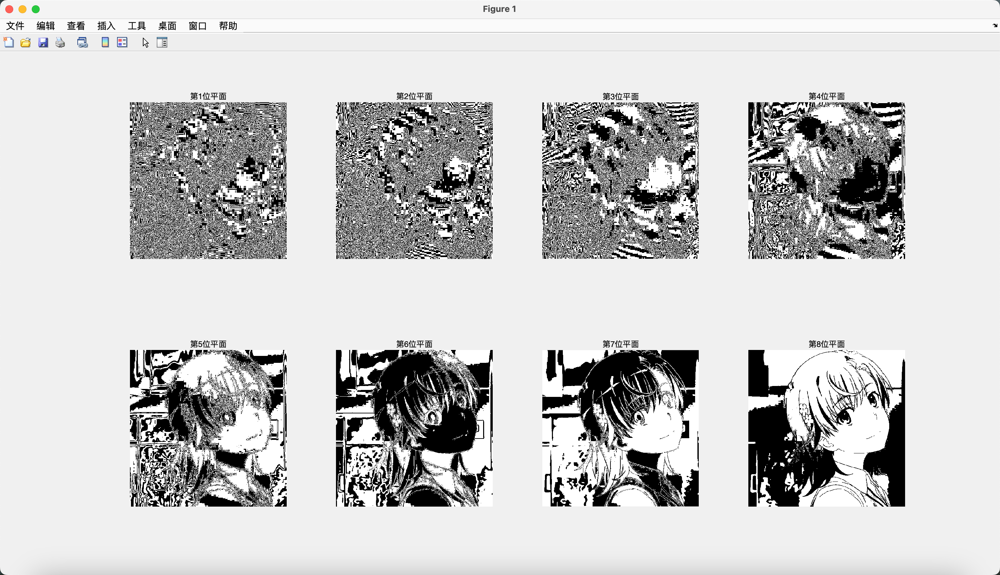

# 信息隐藏 Lab-05 图像的位平面

> 武桐西 2112515 信息安全

## 一、实验目的与要求

本次实验为图像的位平面实验。要求如下：

1. 实现对图像的 1~8 任意位平面的提取与显示；
2. 实现对图像的 1~n 低位平面的图像显示和 (n+1) ~ 8 高位平面的图像显示；
3. 实现去除第 1~n 低位平面后的图像的显示。

## 二、实验原理

### 图像的位平面

图像的位平面(Bit Plane)是指将图像中每个像素的二进制表示中的某一位提取出来形成的平面。

对于灰度图像，一个像素点的取值范围为 $\left[ 0, 255 \right] \cap \mathbb{N}$ （即 $\mathbb{Z}_{256}$ ），需要 $8$ 个bit位来表示，因此一张灰度图像有 $8$ 个位平面；而对于RGB彩色图像，每一个像素都有R、G、B三个通道，每个通道由 $8$ 个bit表示。

图像的位平面对于图像压缩、图像增强以及数字水印（信息隐藏）等领域具有重要意义。

- **图像压缩**：在压缩图像时，可以根据位平面的重要性选择性地保留或丢弃某些位平面，从而实现不同程度的压缩，如在JPEG压缩中的量化过程。
- **图像增强**：通过分析和操作位平面，可以实现图像的增强效果，比如对比度增强、边缘增强等。
- **数字水印**：将水印嵌入到图像的特定位平面中，可以实现对图像的隐藏保护或身份验证。

### MATLAB中的相关位操作函数

本次实验中，需要用到许多位操作，与本次实验相关的位操作函数主要有：

1. `bitget`：获取矩阵的每个元素的第i个比特位的值。
2. `bitset`：设置矩阵的每个元素的第i个比特位的值。

## 三、实验过程

本实验中，选取了两张图像作为实验图像：一是图像处理领域的经典图像Lena图像；另一图像是个人选取的图像。

> ⚠️ 近日，IEEE宣布不再接收包含Lena图像的信号处理研究论文，Lena本人也表示自己是时候在图像处理领域“losing Lena”。
>
> IEEE称此举是为了促进包容和公平，笔者对此不做过多评价。
>
> 时代不断前进，经典终将落幕。笔者在后续的实验中也打算采用其他图像进行实验演示。

原图像如下图所示：


原图像经过灰度化处理后如下图所示：


### 3.1 图像任意位平面的提取与显示

在这一部分，需要提取图像的从第1到第8这8个位平面，并将其显示出来。

```matlab
% Bit Plane of Image
clear;
clc;
close all;

img = imread("images/LenaRGB.bmp"); % Read Image
img = im2gray(img); % Convert RGB to Gray

% Extract bit plane from 1 to 8
figure(1);
for t = 1:8
    bit_plane = bitget(img, t); % Get the t-th bit
    subplot(2, 4, t);
    imshow(bit_plane, []); % Normalize and Display
    title(['第', num2str(t), '位平面']);
end
```

在这部分代码中，主要步骤如下：

1. **图像读取**：使用 `imread` 函数读取图像；
2. **图像灰度化**：使用 `im2gray` 函数将RGB图像转换为灰度图像；
3. **获取位平面**：使用 `bitget` 获取图像的第 `t` 个位平面；
4. **位平面显示**：使用 `imshow` 函数显示图像的位平面；在这一步中，需要注意的是该函数的第二个参数传入 `[]` 表示以矩阵的最小值作为黑色，以矩阵的最大值作为白色，其他值作为灰度颜色，这实际上相当于对图像矩阵进行**归一化**操作，使得图像显示更明显、效果更好。

整个代码通过使用 `for` 循环遍历图像的 8 个位平面。

运行上述代码，得到的结果如下：




从上面的结果中可以看出，随着图像位平面的由低到高，位平面所展示的图像越来越接近原图像；这就是说，越低的位平面包含的图像的信息越少，越高的位平面包含的图像的信息越多。

### 3.2 图像的高位平面与对应的低位平面的提取与显示

在这一部分，我们需要提取图像的第 1~n 低位平面和 (n+1) ~ 8 高位平面，并进行图像的显示。

本部分代码承接前面的代码，新的内容如下：

```matlab
% Filter out lower bit planes and display the remaining higher bits plane
figure(2);
img_size = size(img);
higher_planes = img; % Higher bit planes
lower_planes = zeros(img_size); % Lower bit planes
for t = 1:7
    lower_planes = bitset(lower_planes, t, bitget(higher_planes, t));
    higher_planes = bitset(higher_planes, t, zeros(img_size));
    subplot(4, 4, 2*t-1);
    imshow(higher_planes, []); % Normalize and Display
    title(['Higher ', num2str(8-t), ' bits plane']);
    subplot(4, 4, 2*t);
    imshow(lower_planes, []); % Normalize and Display
    title(['Lower ', num2str(t), ' bits plane']);
end
```

在这一部分的代码中，`lower_planes` 表示图像的低位平面，而 `higher_planes` 则表示与之相对应的高位平面。

整个代码通过 `for` 循环遍历用于分界的位平面，从低比特位向高比特位遍历。

高位平面的初始值赋值为原始图像；低位平面的初始值赋值为全零与原图像大小相同的矩阵。

对于低位平面，每次循环时，将上一次循环的低位平面的下一个比特位平面的值设置为原图像的对应比特位平面（代码中使用的是上一次循环中的高位平面，实际上这二者等价）；而对于高位平面，每次循环时，将上一次循环的高位平面的下一个比特位平面的值设置为0即可。

其他的注意事项与前面部分相同，此处不在赘述。

运行代码，结果如下：


从结果中可以看到，随着分界比特从低比特位向高比特位移动，图像的低位平面逐渐清晰，逐渐逼近原图像，而图像的高位平面逐渐模糊，逐渐丢失原图像的信息；除此之外，图像的高位平面比对应的图像的低位平面更接近原图像。

这说明，图像的高位平面中包含了原始图像的大部分信息，而低位平面只包含原始图像的较少信息，甚至是噪声。

### 3.3 图像任意位平面的去除

在这一部分，我们要去除图像的某一个位平面，并将去除某一位平面后的图像显示出来。

这部分的代码承接上面的代码，新增的代码如下：

```matlab
% Filter out the t-th bit plane and diplay the remaining image
figure(3);
for t = 1:8
    filtered_bit_plane = bitget(img, t);
    remaining_img = bitset(img, t, zeros(img_size));
    subplot(4, 4, 2*t-1);
    imshow(remaining_img, []); % Normalize and Display
    title(['Image with ', num2str(t), '-th bit filted']);
    subplot(4, 4, 2*t);
    imshow(filtered_bit_plane, []); % Normalize and Display
    title(['The ', num2str(t), '-th bit plane']);
end
```

在这部分中，采用 `for` 循环遍历图像的位平面，采用 `bitset` 来设置原始图像的某一个比特位平面的值为0，从而去除（过滤掉）这一比特位平面。

其他的注意事项与前面部分相同，此处不在赘述。

运行代码，结果如下：


从上述结果中，可以看到，去除图像的较低的位平面对图像本身的清晰度和可辨识度的影响不大，去除低比特位平面的图像仍然保留了原始图像的大部分信息；而去除图像的较高的比特位平面对图像的影响较大（特别是第7、8位平面），图像损失了较多的信息。

### 3.4 实验结论

上述实验的源代码可以汇总如下：

```matlab
% Bit Plane of Image
clear;
clc;
close all;

img = imread("images/LenaRGB.bmp"); % Read Image
img = im2gray(img); % Convert RGB to Gray

% Extract bit plane from 1 to 8
figure(1);
for t = 1:8
    bit_plane = bitget(img, t); % Get the t-th bit
    subplot(2, 4, t);
    imshow(bit_plane, []); % Normalize and Display
    title(['第', num2str(t), '位平面']);
end

% Filter out lower bit planes and display the remaining higher bits plane
figure(2);
img_size = size(img);
higher_planes = img; % Higher bit planes
lower_planes = zeros(img_size); % Lower bit planes
for t = 1:7
    lower_planes = bitset(lower_planes, t, bitget(higher_planes, t));
    higher_planes = bitset(higher_planes, t, zeros(img_size));
    subplot(4, 4, 2*t-1);
    imshow(higher_planes, []); % Normalize and Display
    title(['Higher ', num2str(8-t), ' bits plane']);
    subplot(4, 4, 2*t);
    imshow(lower_planes, []); % Normalize and Display
    title(['Lower ', num2str(t), ' bits plane']);
end

% Filter out the t-th bit plane and diplay the remaining image
figure(3);
for t = 1:8
    filtered_bit_plane = bitget(img, t);
    remaining_img = bitset(img, t, zeros(img_size));
    subplot(4, 4, 2*t-1);
    imshow(remaining_img, []); % Normalize and Display
    title(['Image with ', num2str(t), '-th bit filted']);
    subplot(4, 4, 2*t);
    imshow(filtered_bit_plane, []); % Normalize and Display
    title(['The ', num2str(t), '-th bit plane']);
end
```

综上所述，我们可以得出结论：图像的高位平面包含了原始图像的大部分信息，这部分决定着图像的呈现质量、清晰度和可辨识度；图像的低位平面只包含图像的较少的信息（第一个位平面，甚至是第二个位平面），甚至是噪声，因此可以通过去除图像的低位平面来达到图像压缩或者图像去噪的效果，也可以用来隐藏信息（例如图像水印等）。

## 四、总结与思考

本次实验中，我对课堂中给出的代码进行了改动与优化，进一步提升了运行效率以及代码的简洁性和易读性，主要的优化如下：

1. 采用矩阵化运算，而不是课件中给出的 `for` 循环来实现，由于MATLAB对矩阵的极致优化，可以大大提高代码的运行效率。
2. 显示图像时首先进行归一化操作，以提高图像的对比度，使其显示效果更好。

除此之外，我还有以下感悟与体会：

- 通过本次实验，我进一步认识和了解了图像的位平面及其在图像压缩、图像去噪、图像增强以及信息隐藏领域的重要意义和应用。

- 相信通过这次实验的学习和实践，一定会对我未来信息隐藏技术的学习打下坚实的基础，希望以后在信息隐藏这条道路上继续探索、不断进步。
