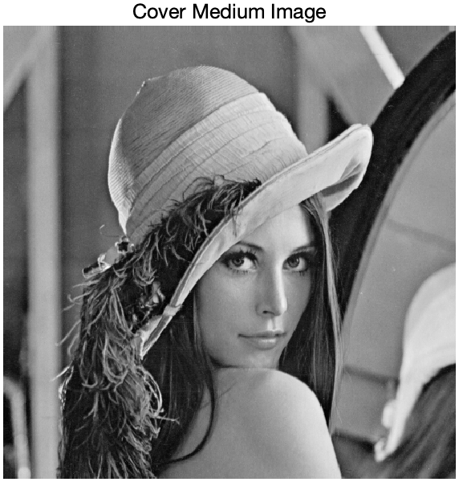
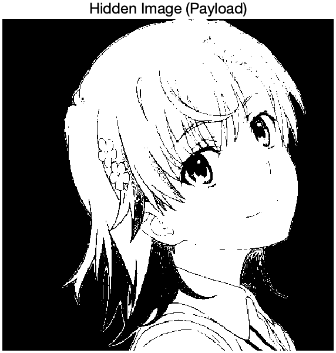
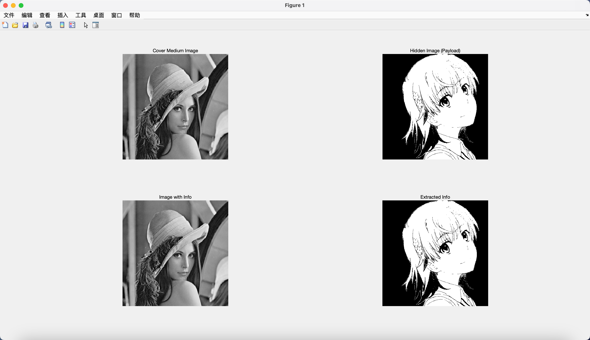
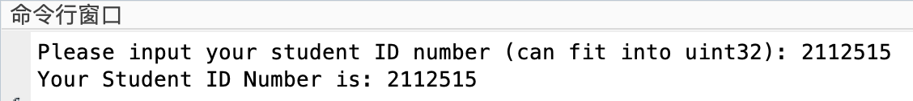
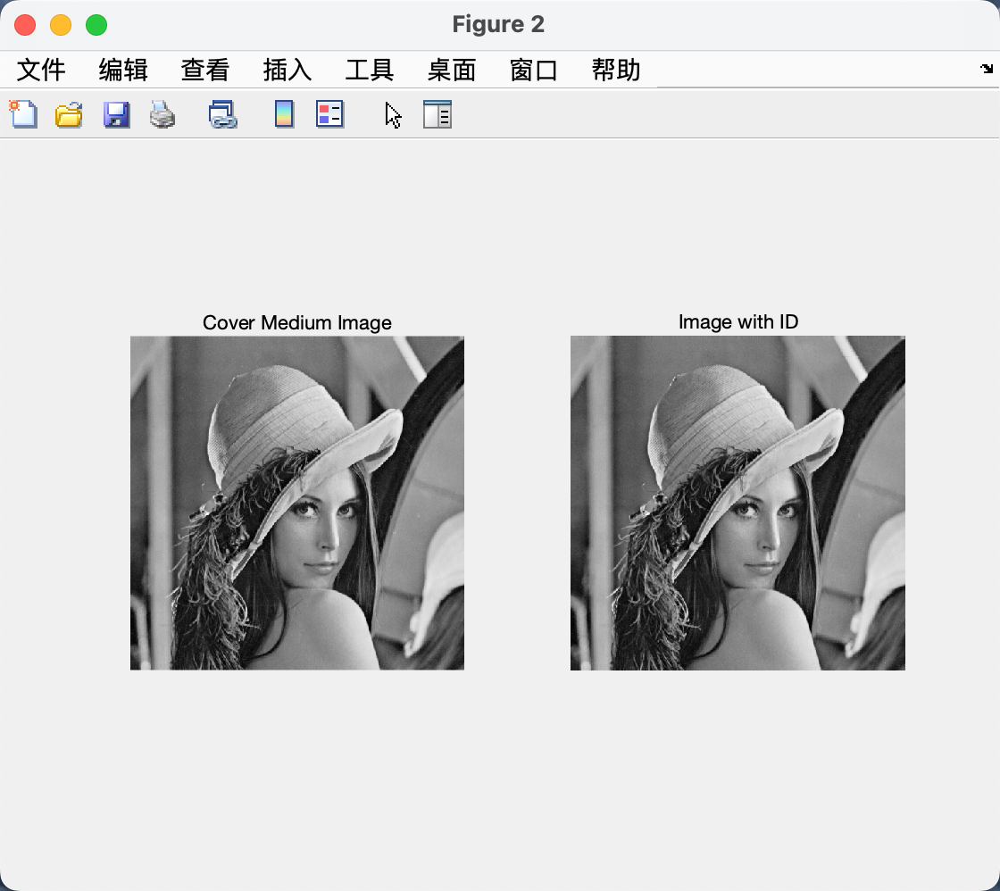
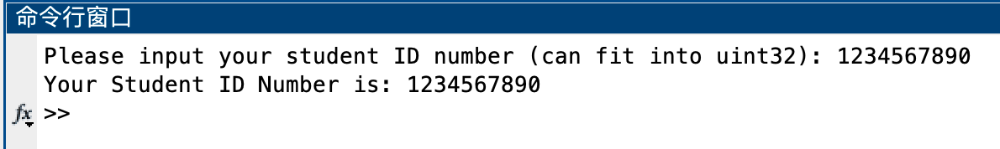

# 信息隐藏 Lab-06 LSB图像隐写

> 武桐西 2112515 信息安全

## 一、实验目的与要求

本次实验要求实现LSB（最低有效位）的图像隐写。具体要求如下：

1. 实现将二值图像嵌入到位图中；
2. 实现将学号（一个整数）嵌入到位图中。

## 二、实验原理

LSB（Least Significant Bit）图像隐写术是一种常见的图像隐写术，通过修改图像像素的最低有效位（LSB）来隐藏秘密信息。

### 原理

1. **LSB原理**：在数字图像中，每个像素由RGB（红绿蓝）或灰度值表示。对于每个颜色通道或灰度值，使用8位二进制数表示，其中最右边的位是最低有效位（LSB），其权重最小，对图像整体影响较小。

2. **信息隐藏**：LSB图像隐写术通过将秘密信息的二进制数据嵌入到图像像素的LSB中来隐藏信息。通常，将LSB替换为秘密信息的二进制位，可以在不引起肉眼可见变化的情况下隐藏信息。

### 步骤

1. **选择载体图像**：选择一个足够大的载体图像，其容量足够容纳要隐藏的信息。

2. **转换为二进制**：将要隐藏的信息转换为二进制数据。

3. **LSB替换**：对载体图像的每个像素，将LSB替换为要隐藏信息的二进制位。例如，如果载体图像像素的LSB是0，要隐藏的信息位是1，则将LSB替换为1；如果LSB是1，信息位是0，则将LSB替换为0。

4. **重建图像**：将修改后的像素重新组合成图像，形成包含隐藏信息的LSB图像。

### 特点

- **隐蔽性强**：LSB图像隐写术在视觉上不易察觉，特别是当嵌入信息量较小、载体图像较大时，难以被发现。
  
- **信息容量**：LSB图像隐写术的信息容量取决于载体图像的大小和色彩深度，通常能够隐藏的信息量相对较小。

- **易实现**：由于原理简单，实现LSB图像隐写并不复杂，可以用于简单的隐写需求场景。

### 应用场景

- **隐秘通信**：LSB图像隐写可用于隐蔽传输少量信息，例如在隐秘通信或数字水印方面有一定应用。

- **数字取证**：LSB图像隐写也常用于数字取证领域，分析人员可能使用LSB隐写技术来隐藏或擅自篡改数字图像中的信息。

### 安全性与稳健性

- **安全性**：尽管LSB图像隐写术在视觉上不易察觉，但它并不提供强大的安全性。对于一些高度敏感或要求高度保密性的信息，单独使用LSB隐写可能不够安全，应考虑加密技术的结合。

- **稳健性**：LSB图像隐写对于图像的处理和压缩可能会造成一定影响。一些图像处理操作或压缩算法可能会破坏LSB隐写嵌入的信息，因此在应用LSB隐写时需要考虑图像的后续处理情况。

### 检测与分析

- **检测方法**：LSB图像隐写的检测可以通过分析图像的LSB位来实现。一些隐写分析工具和算法可以检测图像中LSB位的变化情况，从而发现可能存在的LSB隐写嵌入。

- **防御与对抗**：为了防御LSB图像隐写攻击，可以采取一些对抗性的措施，例如加入噪声、图像处理或对图像进行重新压缩等方法，以增加LSB隐写的检测难度。

### 注意事项

- **容量限制**：LSB图像隐写的信息容量有限，不适用于需要大量隐藏信息的情况。

- **保密性**：LSB图像隐写术并不提供加密功能，只是将信息隐藏在图像中，对抗专业的隐写分析需要结合加密技术。

- **图像格式**：不同图像格式（如JPEG、PNG等）对LSB隐写的容忍度和可见性有所不同，需要根据具体的格式进行调整和测试。例如：

  - **JPEG格式**：JPEG图像经过压缩处理，在LSB隐写时可能会受到压缩算法的影响，导致嵌入的信息难以准确提取或容易被破坏。因此，在使用LSB隐写时需要考虑JPEG图像的压缩质量和算法对隐藏信息的影响。

  - **PNG格式**：PNG图像是一种无损压缩格式，相对于JPEG对LSB隐写更加友好。在PNG图像中使用LSB隐写时，信息的稳定性和可提取性可能会更高一些。

  - **其他格式**：对于其他图像格式如BMP、GIF等，也需要针对其特点和压缩方式进行LSB隐写的测试和调整，以确保隐藏信息的稳定性和隐蔽性。

  综上所述，不同图像格式对LSB隐写的容忍度和可见性有所不同，使用LSB隐写时需要根据具体图像格式的特点进行调整和测试，以提高隐藏信息的稳定性和安全性。

总的来说，LSB图像隐写术是一种简单而有效的图像隐写技术，适用于对隐蔽性要求较高、信息量相对较小的场景。然而，在实际应用中，需要考虑安全性、稳健性、检测与分析以及合规性等方面的因素。

### MATLAB函数

本次实验中，主要用到了以下MATLAB的函数（由于需要操作LSB，因此主要是矩阵的位操作等相关函数）：

- `bitget`：获取矩阵的指定比特位上的值。
- `bitset`：设置矩阵的制定比特位上的值。

## 三、实验过程

本次实验中，准备了以下两张图片，一是图像处理领域经典的Lena图像，二是一张动漫人物图像：


为了方便后续实验，这两幅图像的大小均为 $512 \times 512$ 。

### 二值图像的LSB隐藏

本部分的实验内容是将一张二值化的图像隐藏到载体图像的LSB位图中。

笔者选取Lena图像 `LenaRGB.bmp` 作为载体图像，其大小为 $512 \times 512$ ，并将原RGB彩色图像灰度化为**灰度图像**，如下图所示：



笔者选取 `MisakaMikoto.png` 作为要隐藏的图像（Payload），其大小同样为 $512 \times 512$ ，将其进行灰度化、二值化处理后，得到**二值化图像**如下：



> 💡 **彩色载体图像**
>
> 对于RGB彩色的载体图像，我们同样可以利用LSB进行信息隐藏，比如可以选取某一个通道进行LSB隐写，或者随机（伪随机，发送者与接收者需事先约定并使用相同的伪随机数生成器以及随机种子）选取通道和位置进行LSB隐写。

> 💡 **图像大小不一致**
>
> 对于载体图像和待隐藏的图像的大小不相同的情况，我们同样可以利用LSB进行信息隐藏，以载体图像的大小大于隐写图像（Payload）为例，可以将隐写图像按照某种方式（例如左上角对齐）对应到载体图像，然后在载体图像的对应位置修改LSB即可。

本次实验中，为了实验演示方便，同时也**不失一般性**，采用二者大小相同的情况来演示。

编写如下MATLAB代码：

```matlab
% LSB Steganography
clear;
clc;
close all;

cover_img = imread("images/LenaRGB.bmp"); % Cover Medium
cover_img = im2gray(cover_img); % Convert RGB to Gray
hidden_info = imread("images/MisakaMikoto.png"); % Payload (Hidden Data)
hidden_info = im2gray(hidden_info); % Convert RGB to Gray
hidden_info = imbinarize(hidden_info); % Binarization

% Here I only consider the case where both images are the same size!
assert(isequal(size(cover_img), size(hidden_info)), "Size of Images is NOT equal!");

% Insert into LSB
img_with_info = bitset(cover_img, 1, hidden_info);
% imwrite(img_with_info, "images/img_with_info.jpeg"); % Save Image

% Extract from LSB
info = bitget(img_with_info, 1);

figure(1);
subplot(2, 2, 1);
imshow(cover_img, []);
title("Cover Medium Image");
subplot(2, 2, 2);
imshow(hidden_info, []);
title("Hidden Image (Payload)");
subplot(2, 2, 3);
imshow(img_with_info, []);
title("Image with Info");
subplot(2, 2, 4);
imshow(info, []);
title("Extracted Info");
```

本部分代码的主要思路如下：

1. **图像读取与预处理**：使用 `imread` 读取图像，使用 `im2gray` 将RGB彩色图像转换为灰度图像；对于要隐藏的图像（Payload），还需要使用 `imbinarize` 函数将灰度图像二值化，得到二值化图像作为我们的要隐藏的图像（Payload）。

   需要注意的是，图像的二值化操作函数 `im2bw` 函数在较新版本的MATLAB中已经不推荐使用，而是使用 `imbinarize` 函数进行图像的二值化操作。

2. **LSB隐写**：使用 `bitset` 函数将载体图像的LSB的值设置为Payload图像对应位置的值，即可完成LSB图像隐写。

3. **信息提取**：使用 `bitget` 函数将隐藏后的图像的LSB的值提取出来，即可得到所隐藏的payload信息。

4. **结果展示**：使用 `imshow` 函数绘制载体图像、payload图像、隐藏了payload图像的载体图像、提取出的秘密信息（payload图像）。

   需要注意的是，这里向 `imshow` 函数传入 `[]` 作为第二个参数，是为了将图像矩阵的最小值作为黑色，最大值作为白色，其他中间值作为灰度颜色显示出来，相当于进行了**归一化操作**，这样可以使显示的图像更加清晰、对比明显，有利于人眼观察。

> ⚠️ 注意
>
> 在这里我们假设载体图像与payload图像的大小相同，载体图像为灰度图像，payload图像为二值化图像。
>
> 在我们的代码中，使用了 `assert` 断言函数来保证二者的图像大小相同。

运行上述代码，结果如下：



可以看到，利用LSB进行图像隐写之后得到的带有隐藏信息的图像与原始的载体图像基本一致，人肉眼无法察觉，同时可以成功从该图像中提取出隐藏的图像，说明本次实验非常成功。

### 数值信息的LSB隐藏

在本部分中，我们需要实现将一个数值信息隐藏到图像的LSB中。在这里，我们选择将学号作为待隐藏的信息。

> 🙋 南开大学本科生的学号是 7 位数字，前两位为入学年，第三位为1，后四位是与个人（高考地区等）相关的信息。

在这里，我们将学号视为一个32位的无符号整数，并假定所有的学号都在这个范围中 $[0, 2^{32} - 1]$ 。

同时，学号的输入采用与用户交互的形式，由用户输入自己的学号，随后进行数值信息的LSB隐藏。

> 💡 除此之外，也可以使用 **硬编码** 的方式将学号直接赋值给变量。

基于上述假设，在前面的代码的基础上，编写如下代码：

```matlab
% Insert Student ID into LSB
% Assume that ID is uint32 (4 Bytes or 32 Bits)
id = input("Please input your student ID number (can fit into uint32): ");
id = uint32(id); % Convert double type to uint32

% id = uint32(2112515); % You can also use hard coding
img_with_id = cover_img;
[n_row, n_col] = size(img_with_id);

% Assume that n_col >= 32
assert(n_col >= 32, "n_col should NOT be less than 32!");

% Insert into LSB
for i = 1:32
    img_with_id(1, i) = bitset(img_with_id(1, i), 1, bitget(id, i));
end

% Extract from LSB
extracted_id = uint32(0);
for i = 1:32
    extracted_id = bitset(extracted_id, i, bitget(img_with_id(1, i), 1));
end

figure(2);
subplot(1, 2, 1);
imshow(cover_img, []);
title("Cover Medium Image");
subplot(1, 2, 2);
imshow(img_with_id, []);
title("Image with ID");

fprintf('Your Student ID Number is: %u\n', extracted_id);
```

本部分代码的主要思想如下：

1. **用户输入**：使用 `input` 函数获取用户的输入，作为要隐藏的学号信息，这里假定用户的输入在uint32的范围内。

   这里需要注意的是，`input` 函数获取用户输入后，默认的数据类型为 `double` ，需要使用 `uint32` 函数转换为 `uint32` 数据类型；如果用户的输入超出 `uint32` 所能表示的范围，MATLAB会自动将用户的输入截断，即：小于 $0$ 时将值修改为 $0$ ，值大于 $2^{32} - 1$ 时修改其值为  $2^{32} - 1$ 。

2. **信息嵌入**：将载体信息的第一行的前32个列的LSB的值修改为学号的对应的比特位的值，即可将学号信息隐藏到载体图像中。

3. **信息提取**：将包含信息的图像的第一行的前32列的LSB的值提取出来，作为学号（32位无符号整数）的对应比特位，即可从图像中提取出学号信息。

4. **结果显示**：使用 `imshow` 函数显示载体图像和嵌入了学号信息的图像，这里的 `[]` 参数仍然是为了归一化；最后使用格式化字符串打印出提取到的学号（`fprintf` 函数）。

> ⚠️ 注意
>
> 在上面的代码中，我们假定载体图像的宽要不小于32，以便信息能够被嵌入到图像的一行中。实际上该假设并不必要，可以根据实际情况具体编写LSB隐写代码。

运行上述代码，输入学号为 `2112515` （笔者个人的学号），结果如下：


从图像中提取的学号如下：



可以看到，嵌入了学号信息的图像与原始的载体图像几乎一致，人眼难以分辨；同时可以看到学号被正确的提取出来了，说明本次LSB信息隐藏实验非常成功。

除此之外，笔者也尝试了其他输入（其他学号），结果如下所示：





结果和实验结论同上，这里不在赘述。

## 四、总结与思考

- 经过本次实验，我更加深入地理解了图像的位平面的概念，以及图像的位平面的相关应用，特别是其中的LSB在信息隐藏中的应用。
- 通过本次实验，笔者也了解到虽然LSB信息隐藏技术非常简单，并且具有非常强的视觉隐蔽性，但是LSB隐藏也会存在一些问题，比如会导致图像LSB的统计规律发生变化，从而容易被人发现，使得其隐蔽性降低；同时LSB隐藏的鲁棒性差，并不能抵抗图像去噪或者添加随机噪声，也不能抵抗一些图像压缩算法或者图像处理操作；除此之外，LSB隐藏还需要考虑特定的图像文件格式，针对不同的文件格式作出相应的调整（不同文件格式的隐藏难度以及隐藏后的鲁棒性等可能不同）。
- 本次实验中，笔者采用矩阵化运算，而不是课件中给出的 `for` 循环来实现，由于MATLAB对矩阵的极致优化，可以大大提高代码的运行效率；在显示图像时首先进行归一化操作，以提高图像的对比度和清晰度，使其显示效果更好，更利于人眼观察。
- 相信通过这次实验的学习和实践，一定会对我未来信息隐藏技术的学习打下坚实的基础，希望以后在信息隐藏这条道路上继续探索、不断进步。