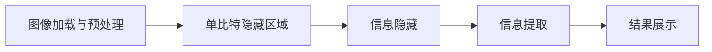
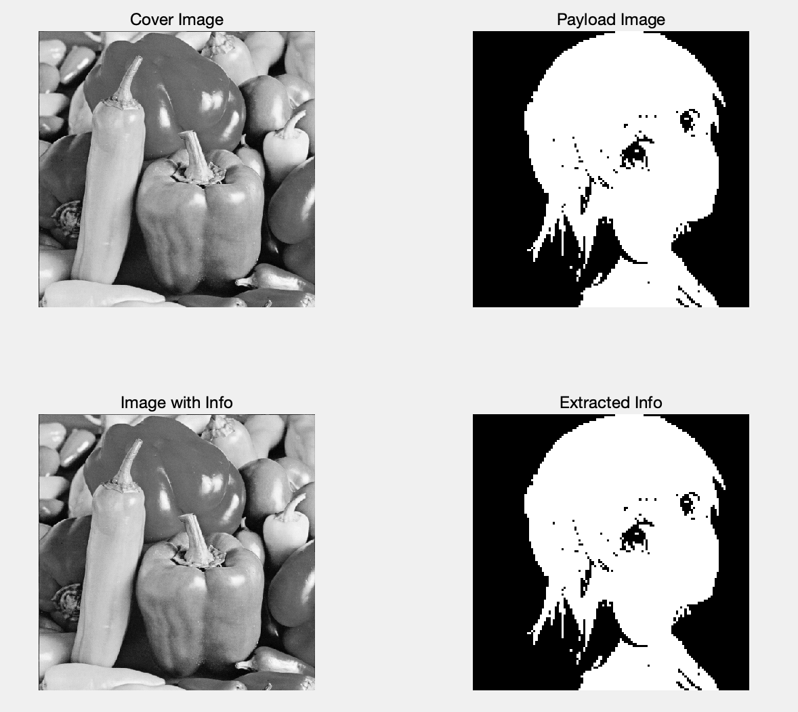

# 信息隐藏 Lab-07 奇偶校验位隐藏法

> 武桐西 2112515 信息安全

## 一、实验目的与要求

本次实验要求实现奇偶校验位隐藏法。具体的要求如下：

1. **隐藏**：利用奇偶校验位隐藏法，实现将秘密图像嵌入到位图中；
2. **提取**：将秘密图像提取出来。

## 二、实验原理

奇偶校验位隐藏法是一种简单而有效的信息隐藏技术，通常用于传输数据时对数据进行校验和隐藏。

### 原理

1. **奇偶校验位**：在传输数据时，奇偶校验位通常用来检测数据中的错误。奇偶校验位可以是奇校验位或偶校验位，其原理是根据数据位中的1的个数来确定校验位的值，以实现数据的校验。

2. **隐藏原理**：利用奇偶校验位的特性，可以将秘密信息嵌入到校验位中。通过调整校验位的值，使得校验位包含了隐藏信息，而不影响数据的校验功能。

### 步骤

1. **选择载体数据**：选择一个包含奇偶校验位的数据作为载体数据，该数据可以是任何可以进行奇偶校验的数据结构，如字节、字符等。

2. **转换为二进制**：将要隐藏的信息转换为二进制数据。

3. **计算奇偶校验位**：对载体数据进行奇偶校验，得到原始的奇偶校验位。

4. **嵌入隐藏信息**：根据要隐藏信息的二进制值，调整奇偶校验位的值，使得校验位包含隐藏信息。

5. **重构数据**：将调整后的奇偶校验位与原始数据结合，形成包含隐藏信息的数据。

### 应用与特点

- **简单实现**：奇偶校验位隐藏法相对简单，不需要复杂的算法或技术即可实现信息隐藏。

- **适用性广泛**：可以应用于各种数据传输场景，如网络通信、文件传输等。

- **隐藏性较弱**：由于奇偶校验位隐藏法的隐藏原理较简单，对专业的隐写分析可能较容易被发现。

- **信息量有限**：由于奇偶校验位的本身只包含一个比特的信息，因此能够隐藏的信息量相对有限。

### 注意事项

- **校验位保持性**：在嵌入隐藏信息时，需要确保调整后的奇偶校验位仍然能够保持原始数据的校验功能，避免影响数据的完整性和可靠性。
- **隐蔽性**：奇偶校验位隐藏法的隐蔽性较弱，不适用于对隐蔽性要求较高的场景，如隐写术的安全传输需求。

总的来说，奇偶校验位隐藏法是一种简单实现的信息隐藏技术，适用于一些简单的信息隐藏需求场景，但其隐蔽性相对较弱，不适用于对隐蔽性和安全性要求较高的场景。

### 奇偶校验位隐藏示例

#### 示例1

##### 信息隐藏

将载体划分为几个不相重叠的区域，在一个载体区域中存储1bit的信息。

选择 $L$ 个不相重叠的区域，计算出每一个区域 $I$ 的所有最低有效位(LSB)比特的奇偶校验位（即 $1$ 的个数的奇偶性）：
$$
b_i = \sum_{j \in I} LSB(c_j) \mod 2
$$
上面的奇偶校验位的计算公式可以写成如下的等价形式：
$$
b_i = \oplus_{j \in I} LSB(c_j)
$$
其中，$\oplus$ 表示**异或**运算。

在嵌入信息时，在对应区域的奇偶校验位上嵌入信息比特 $m_i$ ，若奇偶校验位 $b_i$ 与信息比特 $m_i$ 不同，则将该区域的**所有元素**的最低比特位进行翻转，最终使得二者相同。

> ⚠️ **注意**
>
> 这一做法在区域中的元素个数为偶数时失效，因为将区域中的所有元素的最低比特位翻转之后，所得到的奇偶校验位仍然会与原来的相同。
>
> 证明如下：
>
> 注意到翻转一个比特等价于其与 $1$ 进行异或操作，因而翻转区域内的所有比特之后的奇偶校验位 $b_{i}^{\prime}$ 为：
> $$
> b_{i}^{\prime} = b_i \oplus ( \oplus_{j=1}^{j=|I|} 1 ) = b_i \oplus 0 = b_i
> $$
> 其中用到了 偶数个 $1$ 的异或为 $0$  事实。
>
> 证毕。

##### 信息提取

接收方按照相同的区域划分，计算每一区域的LSB的奇偶校验位，重新排列之后即可提取得到隐藏的信息。

#### 示例2

##### 信息隐藏

示例2与示例1基本一致，区别在于：当奇偶校验位 $b_i$ 与信息比特 $m_i$ 不同，则将该区域的**某个元素**的最低比特位进行翻转，最终使得二者相同。

> ⚠️ **注意**：与示例1不同，示例2中仅翻转一个比特，这一定会使得奇偶校验位同样产生翻转。

##### 信息提取

接收方按照相同的区域划分，计算每一区域的LSB的奇偶校验位，重新排列之后即可提取得到隐藏的信息。

## 三、实验过程

本部分主要分为以下两部分内容：

1. 辅助函数 `calc_parity` ：用于计算区域的LSB的奇偶校验位；
2. 奇偶校验位隐藏法的实现。

### 计算区域的LSB的奇偶校验位

本次实验要实现奇偶校验位隐藏法，为此首先需要一个辅助函数，用于计算某一区域（矩阵）的所有LSB的奇偶校验位值。

该函数的原型如下：

```matlab
parity = calc_parity(patch)
```

其中各参数的含义如下：

- `patch`：要计算LSB奇偶校验位的区域（矩阵）。
- `parity`：函数返回值，即计算得到的奇偶校验位；如果 `patch` 的所有LSB包含**奇数**个 $1$ ，函数返回 $1$ ，否则返回 $0$ 。

函数 `calc_parity` 的定义如下：

```matlab
function parity = calc_parity(patch)
%CALC_PARITY Calculate the parity of the LSBs of given patch (matrix)
%   patch: matrix to calculate LSB Parity
%   parity: the parity returned (return 1 if LSBs of patch have odd number of 1s, else return 0)

patch_LSB = bitget(patch, 1); % Extract LSBs of patch
parity = sum(patch_LSB(:)); % Calculate the sum of LSBs
parity = bitget(parity, 1); % Calculate parity (same as mod(parity, 2))

end
```

该函数计算区域 `patch` 的奇偶校验位，可以采用如下等价的方式实现：

1. 提取区域 `patch` 的LSB；
2. 计算所有LSB之和；
3. 提取上面计算得到的所有LSB之和的LSB（等价于 $\mod 2$ ），即为区域 `patch` 的LSB的奇偶校验位。

### 奇偶校验位隐藏法

本次实验中，选取图像处理领域的经典图片作为载体图像，其大小为 $512 \times 512$。


选取另一张图像作为payload图像，其大小为  $128 \times 128$ 。


编写如下MATLAB代码，实现**任意尺寸图像**的奇偶校验位隐藏与提取：

```matlab
% Steganography using Parity Bit
clear;
clc;
close all;

% Cover Image
cover_img = imread("images/PeppersRGB.bmp"); % Read image
cover_img = rgb2gray(cover_img); % Convert RGB to Gray

% Payload Image
payload = imread("images/MisakaMikoto.png"); % Read image
payload = rgb2gray(payload); % Convert RGB to Gray
payload = imbinarize(payload); % Binarization

% Get Image Size
[cover_rows, cover_cols] = size(cover_img);
[payload_rows, payload_cols] = size(payload);

% Calculate Patch Size
patch_rows = floor(cover_rows / payload_rows);
patch_cols = floor(cover_cols / payload_cols);
assert((patch_rows > 0) && (patch_cols > 0), "Cover image capacity is NOT enough to insert payload!");

% Insert Payload
img_with_info = cover_img;
for i = 1:payload_rows
    for j = 1:payload_cols
        idx_i = (i - 1) * patch_rows + 1;
        idx_j = (j - 1) * patch_cols + 1;
        parity = calc_parity(cover_img(idx_i:(idx_i+patch_rows-1), idx_j:(idx_j+patch_cols-1)));
        if parity ~= payload(i, j)
            % Flip the LSB of the top-left element of current patch
            img_with_info(idx_i, idx_j) = bitxor(img_with_info(idx_i, idx_j), 1);
            % The line above is equivalent to the lines below
            % bit = bitget(cover_img(idx_i, idx_j), 1); % Get LSB of the top-left element of current patch
            % bit = bitxor(bit, 1); % Xor with 1 (i.e. flip the bit) 
            % img_with_info(idx_i, idx_j) = bitset(img_with_info(idx_i, idx_j), 1, bit);
        end
    end
end

% Extract Payload
info = uint8(zeros(payload_rows, payload_cols));
for i = 1:payload_rows
    for j = 1:payload_cols
        idx_i = (i - 1) * patch_rows + 1;
        idx_j = (j - 1) * patch_cols + 1;
        info(i, j) = calc_parity(img_with_info(idx_i:(idx_i+patch_rows-1), idx_j:(idx_j+patch_cols-1)));
    end
end


% Display
figure;
subplot(2, 2, 1);
imshow(cover_img, []); % Normalize and show
title("Cover Image");

subplot(2, 2, 2);
imshow(payload, []); % Normalize and show
title("Payload Image");

subplot(2, 2, 3);
imshow(img_with_info, []); % Normalize and show
title("Image with Info");

subplot(2, 2, 4);
imshow(info, []); % Normalize and show
title("Extracted Info");
```

> 🎉 **自适应隐藏**
>
> 本代码可以根据载体图像与payload图像的大小，自动计算可选取的**单个比特隐藏区域的最大大小**，从而**自适应**地进行信息的隐藏与提取。
>
> 当计算得出的 **单比特隐藏区域的最大大小** 为 $1 \times 1$ 时，则该方法退化为基本的LSB隐藏法。
>
> 若计算得出的 **单比特隐藏区域的最大大小** 的**宽**和**高**中任意一个为 $0$ 时，则表明载体图像的容量不足以隐藏payload信息，程序断言失败，进而退出。

该代码的主要流程为：



1. **图像加载与预处理**：分别加载载体图像与payload图像。对于载体图像，需要将其从RGB彩色图像转换为灰度图像；对于payload图像，除了灰度化之外，还需要再进行图像二值化处理。

2. **计算可选取的单比特隐藏区域的最大大小**：根据载体图像和payload图像的大小，计算可选取的单比特隐藏区域的最大大小，即隐藏的区域单位 `patch` ，方法是根据 载体图像与payload图像的宽(或高)的比值的高斯取整 来得到 区域 `patch` 的宽(或高)。

   在这里笔者实现了**自适应隐藏**，详细前面的部分；这一部分同时还会对 `patch` 的大小进行断言，判断载体图像的容量是否足够隐藏payload图像。

3. **奇偶校验位信息隐藏**：计算每一个 `patch` 区域的奇偶校验位，若其与当前的payload的待隐藏比特不一致，则翻转该 `patch` 区域的左上角的比特位。

4. **奇偶校验位信息提取**：计算每一个 `patch` 区域的奇偶校验位，即可提取出payload。

5. **结果展示**：使用 `imshow` 函数对载体图像、payload图像、隐藏后的图像以及提取出的payload进行可视化。

> ⚠️ **注意**
>
> 在这里笔者采用的是课堂中介绍的奇偶校验位隐藏法的第二种方法（即前面提到的奇偶校验位隐藏示例2），原因如下：
>
> 1. 这种方法改动的比特数量更少；
> 2. 第一种方法在区域 `patch` 的总大小（$width \times height$）为偶数时不适用，因为其无法通过翻转该区域的所有LSB比特实现整个区域的LSB奇偶校验位的翻转。这就是说，第二种方法的通用性更好，而第一种方法有时会失效。

## 四、实验结果与分析

运行上述代码，结果如下：



从上面的结果中可以看到，成功实现利用奇偶校验位将payload隐藏到载体图像中，并且隐藏信息后的图像与原始载体图像几乎没有区别，人眼很难分辨出不同；同时，可以成功的从其中提取出payload图像，并且这一过程是**无损的**。

## 五、总结与思考

- 本次实验中，笔者实现了将**任意尺寸**图像的奇偶校验位隐藏，程序会根据载体图像与payload图像的大小，自动计算可选取的单比特隐藏区域的最大大小作为嵌入信息的区域单位的大小，从而实现**自适应**的奇偶校验位信息隐藏。
- 本次实验中，笔者更加深刻地了解了奇偶校验位隐藏法的原理和实现方法，并亲自编程实践，做到“读万卷书，行万里路”。
- 本次实验中，笔者指出了课堂中所讲授的第一种奇偶校验位隐藏方法的局限性，并给出了严谨的**数学证明**。
- 相信通过这次实验的学习和实践，一定会对我未来信息隐藏技术的学习打下坚实的基础，希望以后在信息隐藏这条道路上继续探索、不断进步。