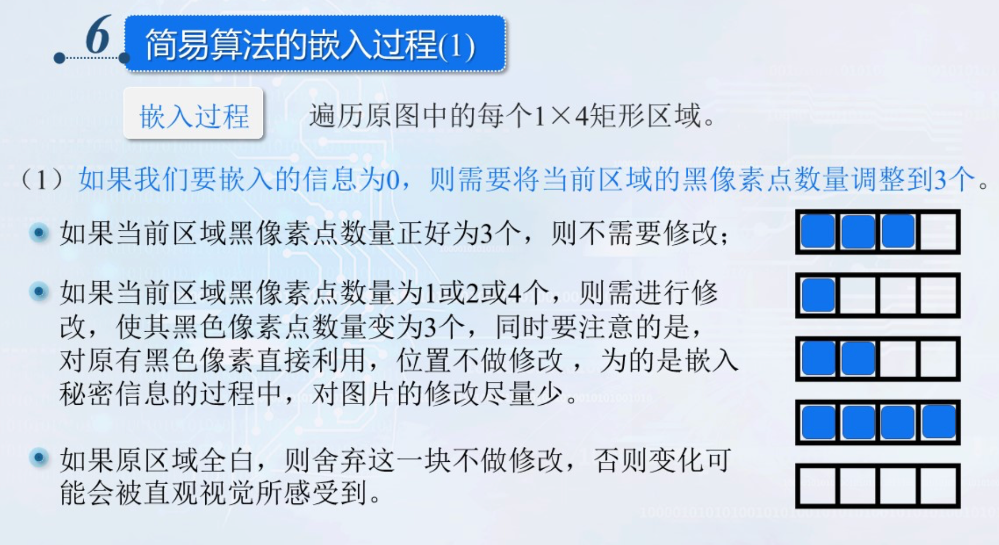
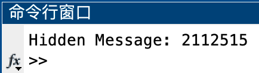

# 信息隐藏 Lab-08 二值图像隐藏法

> 武桐西 2112515 信息安全

## 一、实验目的与要求

本次实验要求实现二值图像的信息隐藏与提取。具体要求如下：

1. **信息隐藏**：利用二值图像隐藏法，实现将秘密信息（可以是图像、文字等信息）嵌入到位图中；
2. **信息提取**：将秘密信息提取出来。

## 二、实验原理

### Zhao-Koch方案

把一个二值图像分成$L(m)$个矩形图像区域$B_i$，如果其中黑色像素的个数大于一半，则表示嵌入0；如果白色像素的个数大于一半，则表示嵌入1。


当需要嵌入的比特与所选区域的黑白像素的比例不一致时，为了达到希望的像素关系，则需要修改一些像素的颜色。修改应遵循一定的规则，原则是不引起感观察觉。修改应在黑白区域的边缘进行。


### 简易算法

将原图划分为1x4 的矩阵像素块，每个区域有连续四个像素点。像素点取值情况共有 5 类：全白，1 个黑像素点，2 个黑像素点，3 个黑像素点和全黑。


需要注意的是：


- 嵌入的信息长度不能过大，不能超过图片大小所能负担的度量；
- 为了简化过程，可以规定接收者己知秘密信息的长度。

### 信息嵌入

#### **嵌入信息为0**

需要将当前区域的黑像素点数量调整到3个。



- 如果当前区域黑像素点数量正好为3个，则不需要修改；
- 如果当前区域黑像素点数量为1或2或4个，则需进行修改，使其黑色像素点数量变为3个，同时要注意的是，对原有黑色像素直接利用，位置不做修改，为的是嵌入秘密信息的过程中，对图片的修改尽量少。
- 如果原区域全白，则舍弃这一块不做修改，否则变化可能会被直观视觉所感受到。

#### **嵌入信息为1**

需要将当前区域的黑像素点数量调整到1个。


- 如果当前区域黑像素点数量正好为1个，则不需要修改；
- 如果当前区域黑像素点数量为0或2或3个，则需进行修改，使其黑色像素点数量变为1个，同时要注意的是，对原有黑色像素直接利用，多余的翻转为白像素，为的是嵌入秘密信息的过程中，对图片的修改尽量少。
- 如果原区域全黑，则舍弃这一块不做修改，否则变化可能会被直观视觉所感受到。


### 信息提取

遍历携密图像的每个1×4 区域，如果黑色像素点个数为1或 3 则提取信息，1 个黑像素点对应 '1'，3 个黑像素点对应 '0'，黑色像素为 0 或 4 为未嵌入信息的区域。

## 三、实验过程

### 实验准备

本次实验中，选取选取图像处理领域的经典图像作为载体图像，如下图所示：


选取一个 32 位无符号整数 (`uint32`) 作为待隐藏的秘密信息，在这里笔者选取自己的学号作为秘密信息：`2112515` 。

> 💡 **秘密信息类型的选择**
>
> 实际上，由于待隐藏的秘密信息最终都会被转换为bit位后再进行信息隐藏，因此选取其他信息（如图像、文本）等本质上与选取32位无符号整数作为秘密信息完全相同，这不过编码与解码的方式会有具体的秘密信息格式相关。
>
> 因此，这里为了方便，选取 32 位无符号整数 (`uint32`) 作为演示。

### 计算给定区域的黑色块数

首先，封装函数 `calc_black_num` 计算给定二值区域的黑色（bit $0$）的个数。

该函数原型如下：

```matlab
blk_num = calc_black_num(patch)
```

其中，各参数的含义如下：

- `patch`：给定的**二值**矩阵区域
- `blk_num`：函数返回值，给定区域中黑色（bit $0$）的块数

该函数的代码如下：

```matlab
function blk_num = calc_black_num(patch)
%CALC_BLACK_NUM Calculate number of blacks of binary matrix `patch`
blk_num = numel(patch) - sum(patch(:));
end
```

### 翻转给定区域的 $n$ 个指定bit

封装函数 `flipped_patch` ，用来翻转给定**二值**矩阵区域的 $n$ 个给定类型比特( `bit_type`  $0$ or $1$ )。

该函数的原型如下：

```matlab
flipped_patch = flip_bits(patch, bit_type, n)
```

其中，各参数含义如下：

- `patch`：给定的**二值**矩阵区域
- `bit_type`：要翻转的bit类型， $0$ 或 $1$ 
- `n`：需要翻转的个数
- `flipped_patch`：函数返回值，翻转后的区域矩阵

该函数的代码如下：

```matlab
function flipped_patch = flip_bits(patch, bit_type, n)
%FLIP_BITS Flip `n` bit(s) of given binary matrix `patch`.
%   bit_type is the bit type (0 or 1) to be flipped

[n_rows, n_cols] = size(patch);

count = 0;
flipped_patch = patch;
terminated = false;
for i = 1:n_rows
    for j = 1:n_cols
        if patch(i, j) == bit_type
            flipped_patch(i, j) = ~bit_type;
            count = count + 1;
        end
        if count == n
            terminated = true;
            break
        end
    end
    if terminated
        break
    end
end

assert(count == n, 'No enough bits to flip!');

end
```

> ⚠️ **注意**
>
> 如果最终翻转的bit个数小于给定的比特数 `n` ，则说明给定区域没有足够的待翻转的比特。
>
> 不过，本次实验中不会出现这种情况。

### 二值图像信息隐藏

按照前面的实验准备，首先进行预处理：

```matlab
% Binary Image Steganography
clc;
clear;
close all;

% Read Image as Cover Medium
img = imread("images/PeppersRGB.bmp"); % Read Image
img = rgb2gray(img); % Convert RGB to Gray
img = imbinarize(img); % Binarize

% payload: uint32
payload = uint32(2112515); % Let's say my student ID: 2112515

% You can also get payload from user input:
% payload = input("Please input your payload number (uint32): ");
% payload = uint32(payload); % Convert double type to uint32
```

主要步骤包括：

1. **载体图像预处理**：读取载体图像，将 RGB 彩色图像转换为灰度图像，并将灰度图像二值化。
2. **加载payload**：获取 32 位无符号整数（这里是笔者的学号）；也可以采用用户输入的方式获取。

我们选取区块的大小为 $1 \times 4$ 的矩形区域。

将payload嵌入载体图像：

```matlab
% Insert payload
[n_rows, n_cols] = size(img);
patch_len = 4; % patch size is 1x4

% Check capacity
assert((floor(n_cols/patch_len) * n_rows) >= 32, 'The capacity of cover image is NOT enough!');

nbit = 0;
terminated = false;
img_with_info = img;
for i = 1:n_rows
    for j = 1:patch_len:(n_cols - patch_len + 1)
        n_blk = calc_black_num(img(i, j:(j+3))); % Number of black
        nbit = nbit + 1;
        curr_bit = bitget(payload, nbit); % Current payload bit

        if curr_bit == 0 % Black
            if n_blk == 1 % flip two white(1) bits
                img_with_info(i, j:(j+3)) = flip_bits(img(i, j:(j+3)), 1, 2);
            elseif n_blk == 2 % flip one white(1) bit
                img_with_info(i, j:(j+3)) = flip_bits(img(i, j:(j+3)), 1, 1);
            elseif n_blk == 4 % randomly flip one bit
                idx = round(rand(1, 1) * 3); % random number in {0, 1, 2, 3}
                img_with_info(i, j+idx) = 1;
            elseif n_blk == 0 % Invalid patch: discard
                nbit = nbit - 1; % BackTracking
            end
        else % White
            if n_blk == 3 % flip two black(0) bits
                img_with_info(i, j:(j+3)) = flip_bits(img(i, j:(j+3)), 0, 2);
            elseif n_blk == 2 % flip one black(0) bit
                img_with_info(i, j:(j+3)) = flip_bits(img(i, j:(j+3)), 0, 1);
            elseif n_blk == 0 % randomly flip one bit
                idx = round(rand(1, 1) * 3); % random number in {0, 1, 2, 3}
                img_with_info(i, j+idx) = 0;
            elseif n_blk == 4 % Invalid patch: discard
                nbit = nbit - 1; % BackTracking
            end
        end
        
        if nbit == 32
            terminated = true;
            break
        end
    end
    if terminated
        break
    end
end

assert(nbit == 32, 'The number of valid patches is NOT enough!');
```

这里按照前面实验原理中介绍的信息隐藏方法进行，根据隐藏的bit信息的值以及当前区域的黑色像素个数进行判断，判断是否舍弃该区块，以及若为有效区块则分别需要翻转的bit的类型、位置与个数等。

> ⚠️ **注意**
>
> 在进行信息隐藏前，需要判断载体图像的容量是否足够。
>
> 同时，如果最终嵌入的信息bit位数小于指定值（这里是 32），则说明载体图像虽然容量足够，但是其中的有效隐藏区域的数量不足，导致没有足够的空间嵌入payload信息。

### 二值图像信息提取

将隐藏的秘密信息从隐藏了秘密信息的载体图像中提取出来：

```matlab
% Extract payload
nbit = 0;
info = uint32(0);
terminated = false;
for i = 1:n_rows
    for j = 1:patch_len:(n_cols - patch_len + 1)
        n_blk = calc_black_num(img_with_info(i, j:(j+3)));
        if n_blk == 3
            nbit = nbit + 1;
            info = bitset(info, nbit, 0);
        elseif n_blk == 1
            nbit = nbit + 1;
            info = bitset(info, nbit, 1);
        end

        if nbit == 32
            terminated = true;
            break
        end
    end

    if terminated
        break
    end
end
```

若当前区块的黑色像素的个数为 $3$ ，则表示秘密信息bit为 $0$ ；若当前区块的黑色像素的个数为 $1$ ，则表示秘密信息bit为 $1$ ；其他情况的区块无效。据此可以提取出秘密信息。

## 四、实验结果与分析

实验结果的展示：

```matlab
% Display Results
figure(1);
subplot(1, 2, 1);
imshow(img, []);
title('Cover Image');
subplot(1, 2, 2);
imshow(img_with_info, []);
title('Image with Info');

fprintf('Hidden Message: %u\n', info);
```

运行实验代码，结果如下：


可以看到载体图像在隐藏信息前后的差别并不大，人眼很难识别出不同。

将图像放大，可以看到一些细微的差异：


提取出的秘密信息如下：



综上所述，本次实验成功地实现了二值图像的信息隐藏与信息提取。

## 五、总结与思考

- 本次实验中，成功地实现了二值图像的信息隐藏与信息提取。
- 本次实验中，实现了一个简易的二值图像信息隐藏方案，结合课堂所学理论进行实践，真正做到了“读万卷书，行万里路”。
- 相信通过这次实验的学习和实践，一定会对我未来信息隐藏技术的学习打下坚实的基础，希望以后在信息隐藏这条道路上继续探索、不断进步。
