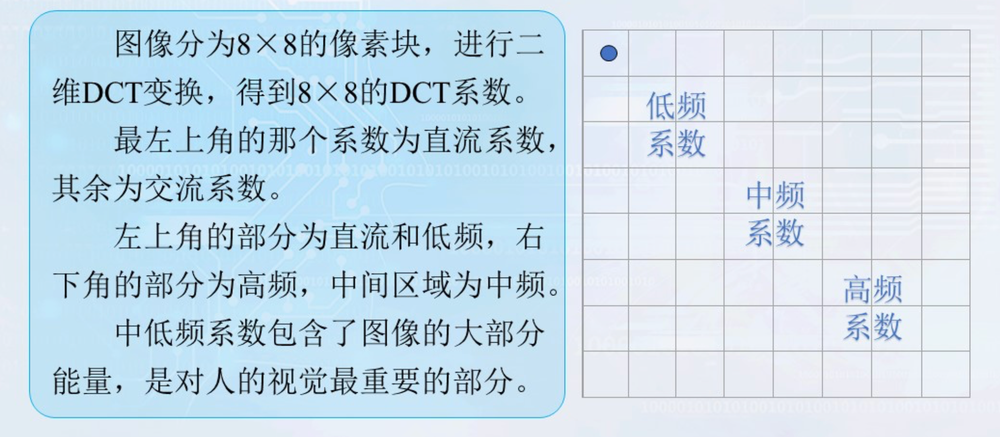
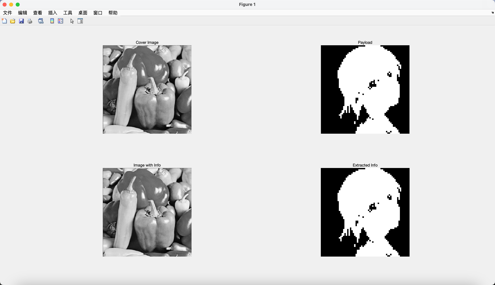

# 信息隐藏 Lab-09 变换域隐藏法

> 武桐西 2112515 信息安全

## 一、实验目的与要求

本次实验要求实现变换域的信息隐藏，主要是采用**DCT**(离散余弦变换)在**频率域**进行信息隐藏。

DCT域的信息隐藏方法包括：

1. 修改系数方法；
2. 系数比较方法。

以上两种方法任选一种，实现变换域中的信息隐藏与提取。

> 💡 本次实验中，采用**修改系数方法**实现**DCT域**的信息隐藏与提取。

## 二、实验原理

### 变换域信息隐藏

在载体的显著区域隐藏信息，比 LSB 方法能够更好地抵抗攻击，而且保持了对人类感观的不可察觉性。常用的**变换域**方法分别有：离散余弦变换（DCT），离散小波变换（DWT），离散傅里叶变换（DFT）。

图像压缩标准（JPEG）的核心便是二维DCT变换，在DCT域中的信息隐藏，可以有效地抵抗JPEG有损压缩。

### 二维离散余弦变换（DCT-2D）

离散余弦变换 (DCT) 将图像表示为不同幅值和频率的正弦的总和。

对于典型图像，DCT 具有这样的属性，即关于图像的大部分视觉上显著的信息只集中在 DCT 的几个系数中。因此，DCT 经常用于图像压缩应用。例如，DCT 是国际标准有损图像压缩算法 JPEG 的核心。

#### 正变换

对于一个 $M \times N$ 的矩阵 $A$ ，其二维离散余弦变换的结果也是一个 $M \times N$ 矩阵 $B$ ，二维DCT的正变换如下：
$$
\begin{array}{c}
B_{p q}=\alpha_{p} \alpha_{q} \sum_{m=0}^{M-1} \sum_{n=0}^{N-1} A_{m n} \cos \frac{\pi(2 m+1) p}{2 M} \cos \frac{\pi(2 n+1) q}{2 N}, \quad 0 \leq p \leq M-1, \,
0 \leq q \leq N-1 \\

\alpha_{p}=\left\{\begin{array}{ll}
1 / \sqrt{M}, & p=0 \\
\sqrt{2 / M}, & 1 \leq p \leq M-1
\end{array} \quad \alpha_{q}=\left\{\begin{array}{ll}
1 / \sqrt{N}, & q=0 \\
\sqrt{2 / N}, & 1 \leq q \leq N-1
\end{array}\right.\right.
\end{array}
$$

#### 逆变换

DCT是一种可逆变换，其逆变换由下式给出：
$$
\begin{array}{l}
A_{m n}=\sum_{p=0}^{M-1} \sum_{q=0}^{N-1} \alpha_{p} \alpha_{q} B_{p q} \cos \frac{\pi(2 m+1) p}{2 M} \cos \frac{\pi(2 n+1) q}{2 N}, \quad 0 \leq m \leq M-1, \, 0 \leq n \leq N-1 \\
\alpha_{p}=\left\{\begin{array}{ll}
1 / \sqrt{M}, & p=0 \\
\sqrt{2 / M}, & 1 \leq p \leq M-1
\end{array} \quad \alpha_{q}=\left\{\begin{array}{ll}
1 / \sqrt{N}, & q=0 \\
\sqrt{2 / N}, & 1 \leq q \leq N-1
\end{array}\right.\right.
\end{array}
$$

### DCT域信息隐藏

将图像分为 $8 \times 8$ 的像素块，进行二维 DCT 变换，得到 $8 \times 8$ 的 DCT 系数。最左上角的系数为**直流系数**，其余为**交流系数**。左上角的部分为直流和低频，右下角的部分为高频，中间区域为中频。**中低频**系数包含了图像的大部分能量，是对人的视觉最重要的部分。



常见的基本隐藏算法有：

- **算法一**：在选出的中频系数中叠加秘密信息 $x^{\prime}(i,j) = x(i,j)+\alpha m_k$ ；

  >  其中，$x(i,j)$ 是 DCT 系数，$x^{\prime}(i,j)$ 是隐藏后的 DCT 系数，$m_k$ 是第 $k$ 个秘密信息比特，$\alpha$ 是可调参数，用于控制嵌入强度；

- **算法二**：在选出的中频系数中叠加秘密信息 $x^{\prime}(i,j) = x(i,j)(1+\alpha m_k)$ ；

- **算法三**：不需要原始载体，直接利用载体中两个特定数的相对大小来代表隐藏的信息；

- **算法四**：算法三的扩展，利用 DCT 中频系数中的三个特定系数的相对关系来对秘密信息进行编码。

  > 对于算法四来说，如果需要做的修改太大，则放弃该块，将其标识为“无效”。对图像进行 DCT变换，比较每一块相应三个位置的系数，从它们之间的关系，可以判断隐藏的信息是“1”、“0”还是“无效”块，这样就可以恢复秘密信息。

## 三、实验过程

本次实验中，采用**算法二**来进行DCT域的信息隐藏与提取实验。

### 实验准备

本次实验中，选取数字信号处理领域中的经典图像 Pepper 作为载体图像，其大小为 $512 \times 512$ ，如下：


选取一张大小为 $64 \times 64$ 的图像作为水印图像（payload），如下所示：


### 信息隐藏

将载体图像分为若干个 $8 \times 8$ 的区块 $B_i$ ，对于每一个区块 $B_i$ ，对其进行 DCT 变换，得到其频域 $B^{\prime}_{i} = \text{DCT-2D}(B_{i})$ 。取其中的直流系数 $B^{\prime}_{i} (0, 0)$ ，若对应的 payload 的 bit 为 $1$ ，则修改直流系数  $B^{\prime}_{i} (0, 0)$ 为 $B^{\prime}_{i} (0, 0) \cdot (1 + \alpha)$ ；若对应的 payload 的 bit 为 $0$ ，则修改直流系数  $B^{\prime}_{i} (0, 0)$ 为 $B^{\prime}_{i} (0, 0) \cdot (1 - \alpha)$ 。

具体的代码如下：

```matlab
% DCT Steganography

clc;
clear;
close all;

% Image Reading and Preprocessing
cover_img = imread("images/PeppersRGB.bmp"); % Cover Image
cover_img = rgb2gray(cover_img); % Convert RGB to Gray
cover_img = double(cover_img) / 255; % Normalization
payload = imread("images/MisakaMikoto.png"); % Payload
payload = rgb2gray(payload); % Convert RGB to Gray
payload = imbinarize(payload); % Binarization

% Config
blk_size = 8;
a = 0.01; % alpha
[m, n] = size(cover_img);
[n_rows, n_cols] = size(payload);

assert(((m >= (n_rows * blk_size))) && ((n >= (n_cols * blk_size))), 'Cover Medium is NOT large enough!');

% Insert
img_with_info = zeros([m, n]);
for i = 1:n_rows
    for j = 1:n_cols
        x = (i - 1) * blk_size + 1;
        y = (j - 1) * blk_size + 1;
        img_with_info(x:(x+blk_size-1), y:(y+blk_size-1)) = dct2(cover_img(x:(x+blk_size-1), y:(y+blk_size-1))); % DCT-2D
        value = payload(i, j) - (~payload(i, j)); % insert 1 if payload bit is 1; else insert -1
        img_with_info(x, y) = img_with_info(x, y) * (1 + a * value);
        img_with_info(x:(x+blk_size-1), y:(y+blk_size-1)) = idct2(img_with_info(x:(x+blk_size-1), y:(y+blk_size-1))); % Inverse DCT-2D
    end
end
```

主要的步骤如下：

1. **图像加载与预处理**：加载载体图像与 payload 图像；对载体图像进行灰度化（RGB 彩色图像转灰度图像）、归一化处理；对 payload 图像进行灰度化、二值化处理。

2. **载体容量判断**：由于选定的区块的大小为 $8 \times 8$ ，因此需要判断载体图像的容量是否足够嵌入 payload 信息。

3. **信息嵌入**：

   - 遍历所有的 $8 \times 8$ 区块，对每个区块进行**二维离散余弦变换**。

   - 根据当前区块对应的 payload 的 bit 位的值确定嵌入的数值。具体而言，若 bit 位为 $1$ ，则嵌入的值为 $1$ ；若 bit 位为 $0$ ，则嵌入的值为 $-1$ 。这里可以不使用 `if` 语句进行判断，而是直接采用如下代码得到嵌入值：

     ```matlab
     % insert 1 if payload bit is 1; else insert -1
     value = payload(i, j) - (~payload(i, j));
     ```

   - 修改当前区块的**直流系数**。将直流系数 $B^{\prime}_{i} (0, 0)$ 变为 $B^{\prime}_{i} (0, 0) \cdot (1 + \alpha \cdot \textrm{value})$ 。

   - 进行**二维离散余弦逆变换**。

### 信息提取

本次实验中的方法的隐藏信息的提取需要使用原始载体图像。

遍历每一个 $8 \times 8$ 区块，判断当前区块的图像的左上角与原始图像的大小，若大于则认为当前隐藏信息的 bit 为 $1$ ，否则为 $0$ 。据此可以从中提取出隐藏的信息。

> ⚠️ **注意**
>
> 这里之所以可以根据原始图像的左上角（不是变换域中的图像）直接得出隐藏信息，是因为我们前面改变的系数只有 DCT 域中的 直流系数，而直流系数
> $$
> B_{0 0}=\frac{1}{\sqrt{MN}} \sum_{m=0}^{M-1} \sum_{n=0}^{N-1} A_{m n}, \quad 0 \leq p \leq M-1, \,
> 0 \leq q \leq N-1
> $$
> 也就是说，直流系数是原图像区块的所有元素和（需要再乘一个系数）；而逆变换后的左上角为
> $$
> \begin{aligned}
> A_{0 0} &= \sum_{p=0}^{M-1} \sum_{q=0}^{N-1} \alpha_{p} \alpha_{q} B_{p q} \cos \frac{\pi(2 m+1) p}{2 M} \cos \frac{\pi(2 n+1) q}{2 N} \\
> & = \frac{1}{\sqrt{MN}} B_{0 0}
> + 
> \sum_{p=1}^{M-1} \sum_{q=1}^{N-1} \alpha_{p} \alpha_{q} B_{p q} \cos \frac{\pi(2 m+1) p}{2 M} \cos \frac{\pi(2 n+1) q}{2 N}
> \end{aligned}
> 
> \quad 0 \leq m \leq M-1, \, 0 \leq n \leq N-1
> $$
> 因此，信息嵌入前后的左上角元素值之差为
> $$
> \begin{aligned}
> A^{\prime}_{0 0} - A_{0 0} &= \frac{1}{\sqrt{MN}} \left( B^{\prime}_{0 0} - B_{0 0} \right) \\
> &= \frac{1}{\sqrt{MN}} B_{0 0} \cdot \alpha \cdot \textrm{value}
> \end{aligned}
> $$
> 而 $\textrm{value}$ 的取值为 $\left\{ -1, 1 \right\}$ ，其余参数的值均为正，因此变换域中直流系数的大小关系与图像域中的左上角的大小关系等价。
>
> 证毕。

信息提取的代码如下：

```matlab
% Extract
info = zeros([n_rows, n_cols]);
for i = 1:n_rows
    for j = 1:n_cols
        x = (i - 1) * blk_size + 1;
        y = (j - 1) * blk_size + 1;
        info(i, j) = img_with_info(x, y) > cover_img(x, y);
    end
end
```

信息提取主要步骤为：遍历每个 $8 \times 8$ 区块，判断嵌入信息后的图像域中的左上角元素与原始载体图像的图像域中左上角元素的大小关系，若大于，则对应的隐藏的信息 bit 为 $1$ ，否则为 $0$ 。

## 四、实验结果与分析

承接前面的代码，实验结果展示的代码如下：

```matlab
% Display
figure();
subplot(2, 2, 1);
imshow(cover_img, []);
title('Cover Image');
subplot(2, 2, 2);
imshow(payload, []);
title('Payload');
subplot(2, 2, 3);
imshow(img_with_info, []);
title('Image with Info');
subplot(2, 2, 4);
imshow(info, []);
title('Extracted Info');
```

运行整个代码，结果如下：



可以看到，成功将 payload 图像嵌入到载体图像中，并且从中成功提取出隐藏的秘密图像（与原始 payload 完全相同）；除此之外，嵌入了秘密信息的载体图像在视觉上与原始载体图像几乎没有区别，人眼很难分辨，保证了信息隐藏的隐蔽性。

同时，由于信息的隐藏是在频域进行的，并且选取的是直流部分，是能量最为集中的区域，因此能够对抗常见的图像压缩等图像处理操作，具有很好的鲁棒性。

## 五、总结与思考

- 本次实验中，笔者实现了 DCT 域的信息隐藏与信息提取。
- 笔者从**数学**上**证明**了该中信息隐藏与信息提取方案的正确性。
- 通过本次实验，笔者更加深刻地理解了离散余弦变换的数学原理以及其对图像的处理方式和处理效果等，同时通过编程实践，做到“读万卷书，行万里路”。
- 相信通过这次实验的学习和实践，一定会对我未来信息隐藏技术的学习打下坚实的基础，希望以后在信息隐藏这条道路上继续探索、不断进步。